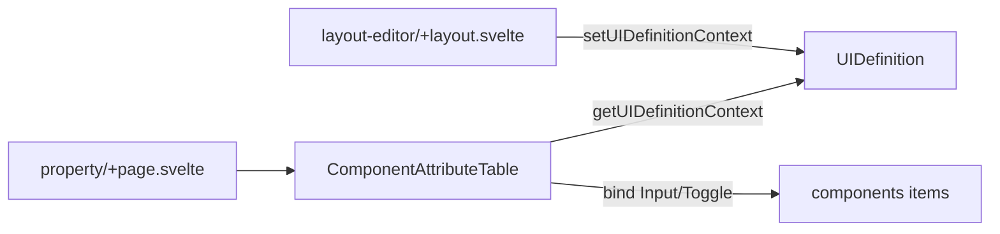

# Property 共通属性テーブル（案1: 初期MVP）

- Date: 2026-08-06
- Source: [Property attribute table](7b46aa60-e40c-427a-b3a8-a3fe19ca2ea7)
- Status: superseded（案2・案3へ改訂）

## Overview

layout-editor の Property 画面に、UIDefinition.components の共通属性（logicalId / type / label / hint / validation.required）を編集する Flowbite データテーブルを実装する。初期データは置かず、0件時は空状態メッセージを表示する。

# Property 共通属性テーブル

## 方針

- 実装場所は [`src/routes/layout-editor/property/+page.svelte`](src/routes/layout-editor/property/+page.svelte)（Layout の DnD は触らない）。
- 状態は既存 Context 経由: `getUIDefinitionContext()`（[`+layout.svelte`](src/routes/layout-editor/+layout.svelte) で既に `setUIDefinitionContext` 済み）。
- UI は flowbite-svelte の `Table` / `Input` / `Toggle`（ルール `05-svelte-ui`）。
- 初期シード・追加ボタンは作らない（YAGNI）。行は将来のツールパレット等から `append` されたものを表示する前提。
- オブジェクトは `$state` 配列内の同一参照なので、セルからプロパティへ直接 bind する（store に setter を増やさない）。

## 列定義（MVP）

| 列ヘッダ | バインド | UI |
|---|---|---|
| logicalId | `component.logicalId` | `Input`（editable） |
| type | `component.type` | テキスト表示のみ |
| label | `component.label` | `Input` |
| hint | `component.hint` | `Input` |
| required | `component.validation.required` | `Toggle` |

※ご記載の「hint : label」は `hint` フィールド編集と解釈。

## 空状態メッセージ案

ツールパレット未実装のため、将来機能に依存しすぎない文言にする:

> コンポーネントがありません。ツールパレットから追加してください。

（実装時はこの1行をテーブル位置に表示。パレット実装後も文言を変えなくてよい。）

## コンポーネント分割

MVP はページ直書きでも動くが、テーブル＋空状態は [`src/lib/components/ComponentAttributeTable.svelte`](src/lib/components/ComponentAttributeTable.svelte) に切り出す。

- props なし / Context から `uiDefinition.components` を読む
- `{#each}` の key は安定な `component.id`（内部 id。`logicalId` は編集対象なので key にしない）

## 変更ファイル

1. **新規** [`src/lib/components/ComponentAttributeTable.svelte`](src/lib/components/ComponentAttributeTable.svelte)
   - `getUIDefinitionContext()`
   - `components.length === 0` → 空メッセージ
   - それ以外 → Flowbite `Table` + 各セル
2. **更新** [`src/routes/layout-editor/property/+page.svelte`](src/routes/layout-editor/property/+page.svelte)
   - プレースホルダ文言をやめ、見出し＋ `ComponentAttributeTable` を配置

## やらないこと（今回）

- ツールパレット / 追加・削除 UI
- DnD・並び替え（Layout 側の将来タスク）
- type 別列（pattern / rows / min 等）
- IR 型の正式化（現状 `any` のまま）
- store API の拡張（`update*` 等）

## Todos

- create-table-component: ComponentAttributeTable.svelte を新規作成（5列 + 空状態）
- wire-property-page: property/+page.svelte にテーブルを配置
