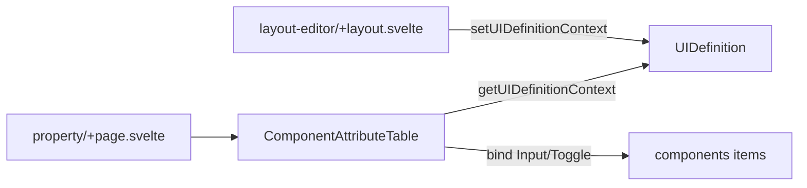

# Property 基本属性テーブル（案3: 最終採用・UX優先）

- Date: 2026-08-06
- Source: [Property attribute table](7b46aa60-e40c-427a-b3a8-a3fe19ca2ea7)
- Status: accepted（実装依頼済み）
- Decision: 列ディスクリプタは見送り。5列 markup 直書き + 基本項目の編集 UX を最優先。

# Property 基本属性テーブル

## 方針

- 実装場所は [`src/routes/layout-editor/property/+page.svelte`](src/routes/layout-editor/property/+page.svelte)（Layout の DnD は触らない）。
- 状態は既存 Context 経由: `getUIDefinitionContext()`（[`+layout.svelte`](src/routes/layout-editor/+layout.svelte) で既に `setUIDefinitionContext` 済み）。
- UI は flowbite-svelte の `Table` 系 / `Input` / `Toggle`（ルール `05-svelte-ui`）。
- **列ディスクリプタや汎用セル描画は作らない。** 5 列を markup に直書きし、各列に最適な入力体験を個別に作り込む（YAGNI / KISS）。将来 basic / option / validation を切り替える話は、その時点で必要な形に改めて設計する。
- 初期シード・追加ボタンは作らない。行は将来のツールパレット等から `append` されたものを表示する前提。
- コンポーネント要素は `$state` 配列内の同一参照なので、セルから `bind:value` / `bind:checked` で直接プロパティへ束縛する（store に setter を増やさない）。

## 列定義

| 列ヘッダ | 対象プロパティ | 編集 |
|---|---|---|
| id | `component.logicalId` | `Input`（テキスト） |
| type | `component.type` | 表示のみ（`Badge`） |
| label | `component.label` | `Input`（テキスト） |
| hint | `component.hint` | `Input`（テキスト） |
| required | `component.validation.required` | `Toggle` |

※ご記載の「hint : label」は `hint` フィールド編集と解釈。

## 編集 UX の作り込み

- 入力は `size="sm"` の `Input` にし、行の高さを詰めて一覧性を確保する。
- 各 `Input` に `placeholder`（例: id は `logicalId`、label は `表示ラベル`、hint は `補足説明`）を置き、空セルでも何を入れる列か分かるようにする。
- ヘッダ以外に列名が読めないスクリーンリーダー向けに、各入力へ `aria-label`（例: `${component.type} の label`）を付ける。
- `id` 列は最初の編集対象なので幅を固定し（`w-56` 相当）、`label` / `hint` は可変幅で広く取る。
- `required` 列は中央寄せの `Toggle`。ラベル文字は出さずヘッダで意味を示し、`aria-label` で補う。
- 行は `hoverable` にして視線追従しやすくする。横幅が足りない環境では `Table` を横スクロール可能にする（`div` に `overflow-x-auto`）。
- 行 key は安定な `component.id`（内部 id）。`logicalId` は編集対象なので key にしない。編集中に再マウントされてフォーカスが飛ぶのを防ぐ。

## 空状態

0 件時はテーブルヘッダごと隠さず、本文に 1 行だけ全列結合したメッセージ行を出す（列構成が先に見えるほうが分かりやすい）。

> コンポーネントがありません。ツールパレットから追加してください。

文言はパレット実装後も変えなくてよい表現にしておく。

## コンポーネント分割

テーブル本体は [`src/lib/components/ComponentAttributeTable.svelte`](src/lib/components/ComponentAttributeTable.svelte) に切り出し、ページは見出しと配置のみ担当する。

- props なし / Context から `uiDefinition.components` を読む

## 変更ファイル

1. **新規** [`src/lib/components/ComponentAttributeTable.svelte`](src/lib/components/ComponentAttributeTable.svelte)
   - `getUIDefinitionContext()`
   - Flowbite `Table` + 5 列を直書き
   - `components.length === 0` のとき結合セルで空メッセージ行
2. **更新** [`src/routes/layout-editor/property/+page.svelte`](src/routes/layout-editor/property/+page.svelte)
   - プレースホルダ文言をやめ、見出し＋ `ComponentAttributeTable` を配置

## やらないこと（今回）

- 列ディスクリプタ / 列グループ切り替え UI
- option / validation の列追加（`pattern` / `rows` / `min` / `disabled` 等）
- ツールパレット / 追加・削除 UI
- DnD・並び替え（Layout 側の将来タスク）
- type 別の列出し分け
- IR 型の正式化（現状 `any` のまま）
- store API の拡張（`update*` 等）
- 入力値のバリデーション（`logicalId` 重複チェック等）
