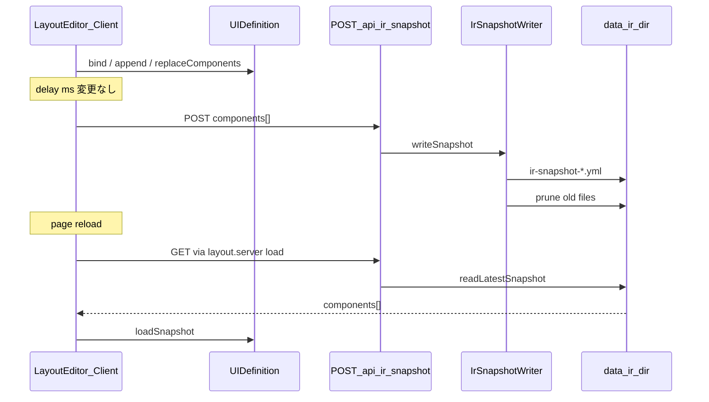

# IR Auto-save Snapshot

- Date: 2026-08-07 17:08 (+09:00)
- Status: implemented

## Problem / goal

Layout editor で UI 定義を編集中、変更が `ir.autoSave.delay` (ms) 途絶えたタイミングで作業状態を FS に snapshot として永続化したい。ページ再読み込み時は最新 snapshot から復元し、一定上限内で世代管理する。

## Proposed approach



### Config

[`config/application-dev.yml`](../config/application-dev.yml):

```yaml
ir:
  autoSave:
    enabled: true
    delay: 500
    dir: ./data/ir
    maxGenerations: 10
```

[`application-config.ts`](../src/lib/server/config/application-config.ts) が `ir.autoSave` をパース。`dir` はクライアントへ渡さない。

### Snapshot format (YAML)

[`src/lib/ir/snapshot.ts`](../src/lib/ir/snapshot.ts):

```yaml
version: 1
savedAt: "2026-08-07T16:56:30.000Z"
components:
  - id: "..."
    type: textbox
```

現行 `UIDefinition.components` の plain object 形状をそのまま保持（IR transform 非経由の暫定 SSOT snapshot）。

### Server I/O

[`src/lib/server/io/ir-snapshot-io.ts`](../src/lib/server/io/ir-snapshot-io.ts):

- `writeSnapshot` — YAML 書き込み + 重複抑制 + prune
- `readLatestSnapshot` / `readLatestSnapshotIfEnabled`
- `pruneSnapshots` — ファイル名タイムスタンプ降順で `maxGenerations` 超を削除

ファイル命名: `ir-snapshot-YYYYMMDDTHHmmss.yml`（衝突時 `-2` 等）

### Routes

| Path | Role |
|---|---|
| `layout-editor/+layout.server.ts` | `autoSave`（enabled, delay）と `initialSnapshot` を load |
| `POST /api/ir/snapshot` | 編集中 components を保存 |

### Client

[`ir-auto-save.svelte.ts`](../src/lib/store/layout-editor/ir-auto-save.svelte.ts) が `$effect` + debounce で POST。初回 hydrate 直後は `lastSavedHash` を現在状態で初期化し不要 POST を抑止。

[`UIDefinition.loadSnapshot`](../src/lib/store/layout-editor/layout-editor.svelte.ts) で reload 時復元。

## Key decisions

| Topic | Decision |
|---|---|
| Format | YAML（`js-yaml`、ユーザー選択） |
| Content | 現行 `components[]` 暫定保持 |
| Restore | ページ reload 時に最新 snapshot を自動 hydrate |
| Prune key | ファイル名タイムスタンプ（mtime より決定的） |
| Duplicate skip | 最新 snapshot と YAML 正規化比較で書き込みスキップ |
| maxGenerations default | 10 |

## Alternatives considered

- **JSON snapshot** — 却下（ユーザーが YAML を選択）
- **Client-only persistence (localStorage)** — 却下（`dir` は server config、FS 永続化が要件）
- **mtime ベース prune** — 却下（ファイル名の方が決定的）

## Open questions

- 本番 FS 書き込みには `@sveltejs/adapter-node` が必要（現状 `adapter-auto`）
- 複数タブ同時編集の競合解決
- snapshot 一覧 UI / 任意世代への手動復元
- IR モデル確定後の envelope 拡張と Raw transform 経由 export との関係

## MVP out of scope

- Raw / IR transform 経由 export
- 手動復元ボタン
- undo/redo、ドメインバリデーション
