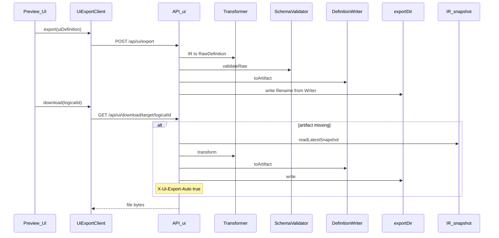

# External UI Definition Export (Skeleton)

- Date: 2026-08-08 04:02 (+09:00)
- Status: implementing

## Problem / goal

Layout editor で編集した IR を、外部 UI 定義（PrimeFaces Facelet / IM-Forma JSON）として `exportDir` に出力し、Preview からダウンロードできるようにする。import は後続。

## Proposed approach

### Key decisions

- `RawDefinition = Record<string, unknown>`（形式別 TS 型は作らない）
- Raw validate は Zod 導入まで TODO 枠（`validateRawDefinition` no-op）
- 外部形式 API は `/api/ui/**`（IR snapshot は `/api/ir/**`）
- ダウンロードは `GET /api/ui/download/[target]/[logicalId]`。未出力時は最新 snapshot から export
- 明示「出力」は編集中 IR を `POST /api/ui/export` で送る
- サーバ: `DefinitionWriter`（PrimeFacesWriter / IMFormaWriter）
  - interface に `fileExtension` は載せない（形式断片の漏洩を避ける）
  - ファイル名・MIME は `describeArtifact` / `toArtifact` が返す（Writer 固有知識）
  - IO は `exportDir/<target>/<logicalId>/` 配置と「渡された filename の書込」だけ知る
- クライアント: `UiExportClient`（同イメージのポート。FS は持たない）
- パス: `<exportDir>/<targetId>/<logicalId>/<filename from Writer>`

### Critique: `fileExtension` on interface

指摘「拡張子は実装クラスだけが知ればよい」の**意図は正しい**。  
`fileExtension` を interface の公開データにして IO が `logicalId + ext` を組み立てるのは、形式断片を共有層へ漏らす anemic な設計になる。

ただし「interface がファイル識別を一切知ってはいけない」と読むと弱くなる。

| 案 | 問題 |
|---|---|
| IO が拡張子を推測 / 連結 | 境界侵犯。新 target のたびに IO 改修 |
| ディレクトリ走査だけで存在判定 | MVP は動くが、複数成果物や命名変更に脆い |
| Writer が FS まで書く | シリアライズと I/O の理由が混ざる |

**採択:** interface には形式断片プロパティを置かず、ポリモーフィックな問い合わせとして `describeArtifact` / `toArtifact` を置く。  
「誰が知っているか」は実装クラス、「どう聞くか」は interface、がポイント。呼び出し側は拡張子文字列を知らない。

### Out of scope

- Reader / import UI
- Zod による Raw validation 本実装
- 完全な vendor スキーマ準拠
- 出力済み stale の自動再 export
