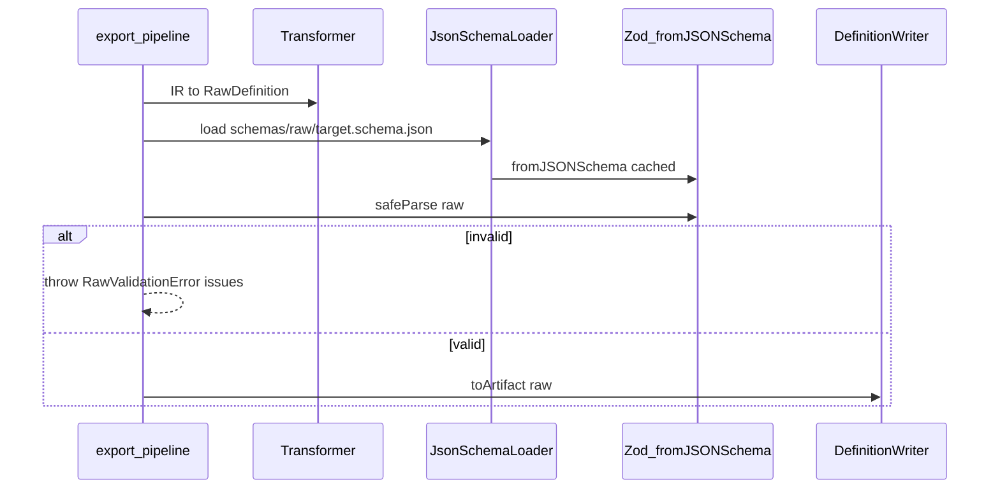

# Raw Validation with JSON Schema + Zod (Export Pre-step)

- Date: 2026-08-08 04:45 (+09:00)
- Status: implemented

## Problem / goal

export パイプラインの Writer 前段で、target 別の RawDefinition を検証したい。  
依存として `zod@4` と `zod-i18n-map` が追加済み。各 target の JSON Schema 骨子も置きたい。

## Critique of the stated flow

提示フロー:

1. transform IR → Raw  
2. load target JSON Schema  
3. validate Raw by zod with target specific JSON Schema  
4. Writer output  

**1 / 2 / 4 はそのまま妥当。3 の言い方が工学的に不正確。**

- Zod は「JSON Schema ファイルを読んで検証するエンジン」ではない。  
  Zod 4 には `z.fromJSONSchema()`（JSON Schema → Zod schema）と `z.toJSONSchema()` がある。
- したがって正確には:

  > JSON Schema を読み込み → Zod schema に変換（キャッシュ）→ `safeParse(Raw)`  

- 「Zod で JSON Schema Validation する」と書くと、Ajv 的な JSON Schema validator と混同しやすい。

### `zod-i18n-map` について（甘さの指摘）

現状スタックは `zod@4.4.3`。`zod-i18n-map@2.27` は:

- Zod **v3** の `z.setErrorMap` / `ZodErrorMap` 前提（最終更新も古く、Zod 4 非対応がコミュニティでも既知）
- peer の `i18next` が package.json に無い

一方 Zod 4 は組み込み locale を持つ（実測: `import ja from 'zod/v4/locales/ja.js'; z.config(ja());` で日本語メッセージが出る）。

**改善策:** 日本語エラーは Zod 4 組み込み `ja` を使う。`zod-i18n-map` / `i18next` は本用途では導入しない（既に入っているなら未使用のまま外す or 将来 UI フォーム向けに再検討）。

## Proposed approach（採択案）

**JSON Schema ファイルを契約の正本（宣言的 SSOT）とし、実行時は Zod に変換して検証する。**



### Why JSON Schema as file SSOT (not hand-written Zod only)

- ユーザー要求どおり「各 target の JSON Schema 骨子」をリポジトリに残せる
- 将来 Reader 側や外部ツールとも同じ契約を共有しやすい
- Zod 手書きと JSON 手書きの**二重管理はしない**（ドリフト防止）

手書き Zod を正本にする案もあるが、今回は「Schema ファイルを先に置く」要求に合わせ、`fromJSONSchema` 経路を採る。  
変換不能な JSON Schema 機能に当たったら、そのときだけ Zod 手書きへ部分移行する（YAGNI）。

### Schema load / cache strategy

**毎回ファイルを読む想定ではない。**

| タイミング | 挙動 |
|---|---|
| サーバ起動時 | 全 target を先読みしない（起動を軽く保つ） |
| target の初回 validate（＝初回出力経路） | JSON Schema を 1 回 load → `fromJSONSchema` → **メモリキャッシュ** |
| 同一 process 内の 2 回目以降 | キャッシュ済み Zod schema で `safeParse` のみ |
| 将来 | Schema 再読込 UI / API でキャッシュ invalidate → 次回（または即時）再 load |

実装イメージ:

```ts
const cache = new Map<string, ZodType>(); // targetId → compiled schema

function getRawZodSchema(targetId: string): ZodType {
  const hit = cache.get(targetId);
  if (hit) return hit;
  const json = readJsonSchemaFile(targetId); // sync/async FS once
  const compiled = z.fromJSONSchema(json);
  cache.set(targetId, compiled);
  return compiled;
}

/** 将来の再読込 UI 用 */
function invalidateRawZodSchema(targetId?: string): void {
  if (targetId) cache.delete(targetId);
  else cache.clear();
}
```

注意:

- SvelteKit / Vite の HMR や複数 worker では process 単位キャッシュになる（dev で schema 編集後は再読込 or 再起動が必要）
- MVP は invalidate API/UI を**用意せず**、`invalidateRawZodSchema` を export してフックだけ残す（YAGNI）

### Module layout

| Path | Role |
|---|---|
| `schemas/raw/primefaces.schema.json` | PrimeFaces Raw 契約骨子 |
| `schemas/raw/im-forma.schema.json` | IM-Forma Raw 契約骨子 |
| `src/lib/schema/json-schema-loader.ts` | 初回 load + Zod 変換キャッシュ + invalidate |
| `src/lib/schema/zod-locale.ts` | `z.config(ja())` 初期化（一度だけ） |
| `src/lib/schema/validate-raw.ts` | target → schema → safeParse。失敗は structured error |
| `src/lib/schema/raw-validation-error.ts` | path / message を API へ返せる形 |
| export pipeline / API | Writer 前で validate。400 + issues |

IO / Writer / Transform はスキーマ内容を知らない（境界維持）。

### JSON Schema 骨子（MVP）

共通方針:

- `additionalProperties: true`（Raw の後付け項目を殺さない）
- 必須は transform が必ず出すキーのみ（`target`, `logicalId`, `name`, 配列）
- field/item は `type` 必須。未知 type は許可（Writer が skip/comment）
- `logicalId` は既存の path-safe パターンに寄せる（任意で pattern）

PrimeFaces: `fields[]`  
IM-Forma: `items[]`  
`target` は各ファイルで `const`

### Runtime validation API

```ts
validateRawDefinition(targetId, raw): asserts raw is RawDefinition
// or returns { ok, issues }
```

- 成功: 何もしない（または parsed を返す）
- 失敗: `RawValidationError`（`issues: { path, message }[]`）
- `POST /api/ui/export` は 400 で `{ error, issues }` を返す
- Preview は statusMessage に要約表示（詳細 UI は後続で可）

### i18n

```ts
import * as z from 'zod';
import ja from 'zod/v4/locales/ja.js';
z.config(ja());
```

サーバ起動/初回 validate 時に一度だけ。`zod-i18n-map` は使わない。

### Out of scope

- Ajv 併用
- import（Reader）側 validation UI の作り込み（同じ `validateRawDefinition` を後で再利用）
- Zod と JSON Schema の二重手書き
- `zod-i18n-map` / `i18next` 本配線

## Open question for implement

なし（上記をデフォルト採択）。実装時に `fromJSONSchema` が落とす制約が出たら設計ログへ追記。
