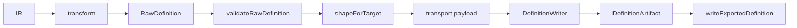

# DefinitionWriter: Raw 加工とシリアライズの分離

- Date: 2026-08-09 14:39 (+09:00)
- Status: implemented (2026-08-09 15:14)

## Problem / goal

Export パイプラインは現状:

`IR → transform → RawDefinition → validateRaw → DefinitionWriter.toArtifact → writeExportedDefinition`

`DefinitionWriter` 実装（`IMFormaWriter` / `PrimeFacesWriter`）が **(1) Raw を transport 向けに加工** と **(2) 文字列成果物へのシリアライズ** を同居させている。

目標:

1. transport target ごとの Raw 加工を、外部ファイル出力（シリアライズ）からモジュール分離する
2. シリアライズ経路を次の3系統に揃える
  - **yaml** — 加工結果を `js-yaml` で dump
  - **json** — 加工結果を `JSON.stringify` で出力
  - **上記以外** — 加工結果を Handlebars テンプレートに埋め込んで出力
3. YAGNI / 既存 `ExportTargetBundle` 境界を崩さない

## Proposed approach

### 責務分割


| 層                                                | 責務                                                               | 非責務                    |
| ------------------------------------------------ | ---------------------------------------------------------------- | ---------------------- |
| `transform/*`                                    | IR ⇄ Raw（現状維持）                                                   | ファイル文字列・テンプレート         |
| `schema/*`                                       | Raw 境界検証（Writer 前）                                               | 加工後ペイロードの再検証           |
| **NEW** Raw → transport payload（shape / project） | 検証済み Raw を target 固有の埋め込み用データへ整形                                 | FS・拡張子・MIME・シリアライズ API |
| `DefinitionWriter`                               | payload → `DefinitionArtifact`（filename / contentType / content） | IR 知識・Zod・ディレクトリ配置     |
| `definition-export-io`                           | 成果物の配置・書込（現状維持）                                                  | 形式知識                   |


検証対象は **shape 前の Raw**（現状どおり）。shape 後ペイロードは Schema の対象外。




### シリアライズ戦略（Writer 側の共通ヘルパ）

target ごとのクラスは薄くし、本文生成だけを戦略ヘルパに委譲する。


| 戦略           | 入力                        | 出力                 | 実装                                 |
| ------------ | ------------------------- | ------------------ | ---------------------------------- |
| `json`       | plain object              | pretty JSON + 末尾改行 | `JSON.stringify(payload, null, 2)` |
| `yaml`       | plain object              | YAML 文字列           | `js-yaml.dump`                     |
| `handlebars` | context object + template | レンダリング文字列          | `Handlebars.compile`（プロセス内キャッシュ可）  |


MVP では **汎用 Writer ファクトリを作らない**。共通は serialize 関数 3 本までに留め、`IMFormaWriter` / `PrimeFacesWriter` は `shape` + `serialize`* + `describeArtifact` を呼ぶ薄い実装のまま置く。

### モジュール配置案

既存境界（`transform` = IR⇄Raw、`io` = 外部入出力）を壊さないため、shape は Writer 近傍に置く（Reader/Writer/Transformer に形式知識を寄せる方針と整合）。

```text
src/lib/server/io/
  writers/
    definition-writer.ts          # interface（変更小）
    serialize/
      serialize-json.ts
      serialize-yaml.ts
      serialize-handlebars.ts     # compile キャッシュ含む
    shape/
      im-forma-shape.ts           # Raw → JSON 用 payload
      primefaces-shape.ts         # Raw → Handlebars context
    im-forma-writer.ts            # shape + serializeJson + describeArtifact
    primefaces-writer.ts          # shape + serializeHandlebars + describeArtifact
    definition-writer.spec.ts
  ...
templates/export/                 # リポジトリ直下（案）
  primefaces/
    form.hbs                      # 現行 xhtml 文字列組み立てを移植
```

代替配置（採用しない／後回し）:

- `src/lib/transform/*-shape.ts` — IR⇄Raw 境界を曖昧にするため非推奨
- 新規トップレベル `src/lib/export/` — 将来 target / 戦略が増えたら再検討可。現状は過剰

### target ごとの中身（現状からの移動）

#### `im-forma`（json）

- **shape**（現行 `IMFormaWriter.toArtifact` 内の payload 組み立てを移設）:
  - `formId` / `formName` / `description` / `version` / `items`
- **serialize**: `serializeJson(payload)`
- Schema / transform は現状の Raw 形状のまま

#### `primefaces`（handlebars）

- **shape**:
  - `formId`, `name`, `fields[]`（logicalId / type / label / required / hint 等）
  - タグ種別の決定（textbox→inputText 等）は shape 側か、template の `{{#if}}` のどちらか一方に寄せる。MVP 推奨は **shape で** `tag` **等の表示用フィールドを付ける**（テンプレート分岐を浅くする）
- **serialize**: `templates/export/primefaces/form.hbs` を Handlebars で描画
- **sanitize / escape（確定）**: Handlebars 既定の HTML escape（`{{value}}`）を優先する
  - shape 内で `escapeHtml` 等の独自エスケープは行わない（二重 escape・独自ロジックの甘さを避ける）
  - テンプレートではユーザー由来文字列を `{{...}}` で埋め込む。意図的に生出力が必要な箇所のみ `{{{...}}}`（原則使わない）
  - `$lib/utils/escape-html` は Handlebars 経路の sanitize には使わない（Preview 等・別用途は対象外）

#### yaml（将来 target 用の枠）

- 現状 target は無し。`serializeYaml` だけ先に用意し、最初の yaml target 追加時に `shape` + thin Writer を足す

### shape とは何か（詳細）

`transform` が作る Raw は「検証可能な中間モデル」であり、ベンダー最終ファイルのキー名・階層・表示用派生値とは一致しないことがある。  
**shape** はそのギャップを埋める「埋め込み直前の ViewModel 組み立て」である。


|     | `transform`（IR → Raw）      | `shape`（Raw → transport payload）      |
| --- | -------------------------- | ------------------------------------- |
| 入力  | IR meta + components       | 検証済み `RawDefinition`                  |
| 出力  | Schema で検証する Raw           | json/yaml/hbs にそのまま渡せるオブジェクト          |
| 関心  | ドメインに近い中間表現                | ベンダー成果物の語彙・階層・派生フィールド                 |
| 例   | `name`, `items` / `fields` | `formName`, `tag: 'inputText'`, 既定値補完 |


**shape がやること**

1. キー名のベンダー寄せ（`name` → `formName` 等）
2. 欠落時の既定値・型ガード（配列でない `fields` → `[]`）
3. テンプレート/シリアライザ向けの派生値（IR `type` → PF タグ名）
4. 出力に不要な Raw フィールドの間引き

**shape がやらないこと**

1. 文字列エスケープ（Handlebars に委譲）
2. ファイル名・MIME・FS
3. Schema 検証
4. テンプレート文字列そのものの保持

#### ユースケース A: im-forma（キー名のズレ）

Schema / Raw は編集・検証向け:

```json
{
  "target": "im-forma",
  "logicalId": "myForm",
  "name": "My Form",
  "items": [{ "logicalId": "name", "type": "textbox", "label": "Name" }]
}
```

最終 JSON はベンダー語彙:

```json
{
  "formId": "myForm",
  "formName": "My Form",
  "description": "",
  "version": "",
  "items": [{ "logicalId": "name", "type": "textbox", "label": "Name" }]
}
```

```typescript
// shape/im-forma-shape.ts（イメージ）
export function shapeImForma(raw: RawDefinition) {
  return {
    formId: typeof raw.logicalId === 'string' ? raw.logicalId : 'form',
    formName: typeof raw.name === 'string' ? raw.name : '',
    description: typeof raw.description === 'string' ? raw.description : '',
    version: typeof raw.version === 'string' ? raw.version : '',
    items: Array.isArray(raw.items) ? raw.items : []
  };
}
// serialize は JSON.stringify するだけ。escape は不要。
```

ここが shape の最小例: **同じ意味でもファイル上の形が違う**ので、Writer やテンプレートに Raw を直渡ししない。

#### ユースケース B: primefaces（派生値 + テンプレを薄く）

Raw `type: 'textbox'` は IR 語彙。Facelet は `<p:inputText>`。  
shape で表示用 `tag` を付け、hbs はループと属性埋め込みに専念する。

```typescript
// shape/primefaces-shape.ts（イメージ）
function mapTypeToTag(type: string): string {
  switch (type) {
    case 'textbox': return 'inputText';
    case 'textarea': return 'inputTextarea';
    case 'number': return 'inputNumber';
    default: return 'unsupported';
  }
}

export function shapePrimeFaces(raw: RawDefinition) {
  const fields = Array.isArray(raw.fields) ? raw.fields : [];
  return {
    formId: typeof raw.logicalId === 'string' ? raw.logicalId : 'form',
    name: typeof raw.name === 'string' ? raw.name : 'form',
    fields: fields
      .filter((f): f is Record<string, unknown> => !!f && typeof f === 'object')
      .map((f) => ({
        id: typeof f.logicalId === 'string' ? f.logicalId : 'field',
        label: typeof f.label === 'string' ? f.label : '',
        hint: typeof f.hint === 'string' ? f.hint : '',
        required: f.required === true,
        tag: mapTypeToTag(typeof f.type === 'string' ? f.type : 'unknown'),
        type: typeof f.type === 'string' ? f.type : 'unknown'
      }))
  };
  // WARN: ここでは escape しない。Handlebars の {{ }} に任せる。
}
```

```handlebars
{{!-- templates/export/primefaces/form.hbs（抜粋イメージ） --}}
<title>{{name}}</title>
<h:form id="{{formId}}">
  {{#each fields}}
    <p:outputLabel for="{{id}}" value="{{label}}" />
    {{#if (eq tag "unsupported")}}
      <!-- unsupported type: {{type}} id={{id}} -->
    {{else}}
      <p:{{tag}} id="{{id}}"{{#if required}} required="true"{{/if}}{{#if hint}} placeholder="{{hint}}"{{/if}} />
    {{/if}}
  {{/each}}
</h:form>
```

（`eq` helper や動的タグ `p:{{tag}}` の可否は実装時に調整。分岐を hbs に寄せる案もある。）

#### shape が無いとどうなるか

- json: Writer が「キーリネーム + stringify」を同時にやり、単体テストが成果物文字列依存になる
- hbs: テンプレートが `raw.fields.[0].logicalId` や type 分岐で肥大化し、レイアウト変更とマッピング変更が同居する

shape があると「マッピングの期待値」をオブジェクト比較でテストでき、テンプレートは見た目の差し替えに閉じる。

### Writer 実装のイメージ（擬似）

```typescript
// im-forma-writer.ts
toArtifact(raw: RawDefinition): DefinitionArtifact {
  const identity = this.describeArtifact(/* logicalId from raw */);
  const payload = shapeImForma(raw);
  return { ...identity, content: serializeJson(payload) };
}

// primefaces-writer.ts
toArtifact(raw: RawDefinition): DefinitionArtifact {
  const identity = this.describeArtifact(/* ... */);
  const context = shapePrimeFaces(raw);
  return {
    ...identity,
    content: serializeHandlebars('primefaces/form', context)
  };
}
```

### パイプライン / Registry

- `export-pipeline.ts` の呼び出し契約は維持: `bundle.writer.toArtifact(raw)`
- `ExportTargetBundle` に shape を公開フィールドとして足す必要は **ない**（shape は Writer 内部依存で十分）
- 将来「shape 結果をデバッグ API で見たい」場合のみ registry 公開を検討

## Dependencies

### 追加済みで十分


| パッケージ        | 用途                              |
| ------------ | ------------------------------- |
| `js-yaml`    | yaml 戦略（snapshot/config でも使用済み） |
| `handlebars` | xhtml 等・構造化シリアライズ以外             |


### 今は不要（推奨しない）


| 候補                                     | 理由                                                      |
| -------------------------------------- | ------------------------------------------------------- |
| Mustache / EJS / Liquid                | エンジン重複。Handlebars で足りる                                  |
| `xmlbuilder` / `fast-xml-parser`       | Facelet はテンプレートの方が読みやすい。構造 XML 編集が必要になるまで延期             |
| `prettier`（出力整形）                       | JSON/YAML の indent と hbs 整形で足りる。依存コスト高                  |
| `@types/js-yaml` / `@types/handlebars` | 現行パッケージが型を同梱していれば不要。`check` で不足が出たときだけ devDependency 検討 |


### あると便利だが必須ではない


| 候補                          | いつ検討するか                                      |
| --------------------------- | -------------------------------------------- |
| Handlebars precompile（ビルド時） | テンプレート数・ホットパスが増えたとき。MVP は実行時 compile + キャッシュ |


## Alternatives considered

1. **Writer 内に加工を残し serialize だけ共通化** — 分離が中途半端。payload 単体テストがしづらい
2. **汎用** `createDefinitionWriter({ strategy, shape, template })` — target 2 個の時点では抽象が早い（3+ で再検討）
3. **shape を** `transform/` **に含める** — 「IR⇄Raw」と「Raw→ベンダー埋め込みモデル」が混ざる
4. **独自** `escapeHtml` **を Handlebars helper / shape に使う** — 棄却。Handlebars 既定 escape（`{{ }}`）を優先

## Key decisions（確定）

1. shape は `src/lib/server/io/writers/shape/`、serialize は同階層 `serialize/`
2. **Schema 検証は shape 前 Raw のみ**。Shape 再検証はしない（Raw が target Schema を満たし、shape 変換が十分信頼できる前提）
3. Handlebars テンプレート根は `app.io.export.templates.<targetId>.dir`（IdP 固有設定に近い target 別マップ）。既定: `./templates/export/primefaces`
4. Registry / pipeline の公開 API は変えない（クライアントは targetId だけ知り、json/yaml/hbs の戦略は知らない）
5. 新規 npm 依存は当面不要
6. Handlebars 経路の sanitize は Handlebars 既定 escape。独自 `escapeHtml` は使わない
7. **serialize 戦略は Writer 内部実装詳細**。Preview / client は出力形式（拡張子・MIME 以外の「どう書くか」）を選ばない
8. **IR** `type` **とテンプレート選択（将来）**
  - 将来: コンポーネント種別ごとに部分 hbs を Strategy 的に選ぶキーとして `type` を使う想定
  - MVP: type 別 partial 選択は **実装しない**（現行相当の単一 form テンプレートで足りる）
  - shape に処理用に `type` を残してよい
  - **ベンダー成果物に含まれる** `type`**（例: im-forma** `items[].type`**）は除外しない**
  - 除外対象は「テンプレ選択・内部処理専用の派生キー」（将来の `_partial` / 内部専用フラグ等）。json/yaml serialize 前に落とすか、そもそも structured payload に載せない

## Open questions — 解消メモ

### 1. type → タグ / hbs（ユーザー回答）

- 将来の Strategy キーとして IR `type` を想定。MVP は type 別 hbs 選択なし
- shape への `type` 保持は可。内部専用キーだけ structured 出力から除外
- MVP の PrimeFaces: 現行どおり type→タグ対応は shape または単一 hbs 内で従来同等に再現すればよい（将来の partial 分割に備え shape に `type` を残すのは可）

### 2. yaml serialize ヘルパをいつ用意するか（質問意図の再掲）

元の意図は **Preview の形式選択ではない**。

- 「いま yaml を吐く target が無いのに、`serialize-yaml.ts` を空の共通ヘルパとして先に置くか」
- 「最初の yaml target（Writer）を足すタイミングで `serializeYaml` も同時に足すか」

ユーザー補足どおり、クライアントは戦略を知らない。各 Writer が内部で json / yaml / handlebars を選ぶ。

**提案（YAGNI）:** `serialize-yaml.ts` は **最初の yaml Writer 追加時に同時作成**。MVP（im-forma=json, primefaces=hbs）では json + handlebars のみ。

### 3. テンプレートパス（ユーザー回答 → 確定）

- `application-config` でルートを変更可能にする（例: `app.io.exportTemplateDir` または同等）
- アプリコードは「設定された根 + target 相対パス」だけを見る

## Change targets（実装時）


| パス                                                                       | 変更                                   |
| ------------------------------------------------------------------------ | ------------------------------------ |
| `src/lib/server/io/writers/shape/im-forma-shape.ts`                      | **新規**                               |
| `src/lib/server/io/writers/shape/primefaces-shape.ts`                    | **新規**                               |
| `src/lib/server/io/writers/serialize/serialize-json.ts`                  | **新規**                               |
| `src/lib/server/io/writers/serialize/serialize-handlebars.ts`            | **新規**（config の template 根を参照）       |
| `src/lib/server/io/writers/serialize/serialize-yaml.ts`                  | **後続**（yaml Writer 追加時）              |
| `src/lib/server/config/application-config.ts` (+ spec)                   | template 根パス設定を追加                    |
| `templates/export/primefaces/form.hbs`                                   | **新規**（既定配置。パスは config で差し替え可）       |
| `src/lib/server/io/writers/im-forma-writer.ts`                           | shape + serializeJson に薄く            |
| `src/lib/server/io/writers/primefaces-writer.ts`                         | shape + serializeHandlebars に薄く      |
| `src/lib/server/io/writers/definition-writer.spec.ts`                    | shape / serialize 分離に合わせて更新・分割       |
| `src/lib/server/io/writers/shape/*.spec.ts` 等                            | **新規**（payload 単体）                   |
| `docs/use-cases/ui-export.md`                                            | 実装後: Writer 内部分解・templateDir・検証境界を追記 |
| `export-pipeline.ts` / `raw-definition.ts` / `export-target-registry.ts` | **原則変更なし**                           |


## Out of scope

- Reader / import
- Shape 後ペイロードの Schema 化（再検証しない方針）
- 汎用 Writer ファクトリ
- type 別 hbs partial の Strategy 選択（将来）
- テンプレートのビルド時 precompile
- MVP での `serialize-yaml` 先行追加

