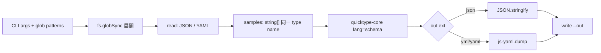

# quicktype による JSON Schema 推論 npm script

Date: 2026-08-10 10:30

## Problem / goal

複数の具体例ファイル（JSON / YAML）から、1 つの JSON Schema 草案を生成する補助ツールが欲しい。

要件:

- YAML の input / output をサポートする
- 複数サンプル → 単一 schema（optional / union 推論を活かす）
- `path/to/*.json` のようなワイルドカードを、Windows でも確実に解決する

制約（調査結果）:

- `quicktype` 本体の入力は JSON / JSON Schema / TypeScript / GraphQL。**YAML は非対応**
- 出力の `schema` 言語も JSON テキスト。YAML schema は自前変換が必要
- Windows の `npm run` / cmd は `*` をシェル展開しないことが多い。PowerShell は引用の有無で挙動が変わるため、**Node 側で glob 解決**するのが安全
- 本リポジトリの本番 schema（`schemas/raw/*.schema.json`）は draft 2020-12 の手書き品質（`const` / `pattern` 等）。quicktype 出力は草案であり、そのまま差し替え前提にはしない

## Proposed approach（推奨）

薄い Node ESM ラッパー + `quicktype-core` プログラマティック API。

### 配置

| 項目 | 案 |
|---|---|
| スクリプト | `scripts/schema-infer.mjs`（追加依存なしで `node` 実行） |
| npm script | `"schema:infer": "node ./scripts/schema-infer.mjs"` |
| エンジン | 既に入っている `quicktype` / 推移依存 `quicktype-core` |
| YAML | 既存 `js-yaml` |
| glob | Node 組み込み `fs.globSync`（Node 22+。現行 v24 で利用可） |

`package.json` 変更は承認後に実施。`quicktype` は codegen 用途のため **`devDependencies` へ移す**のを推奨（現状は `dependencies`）。

### CLI 契約

```bash
npm run schema:infer -- \
  --out schemas/raw/primefaces.schema.draft.json \
  --name PrimeFacesRaw \
  "schemas/samples/primefaces/*.json" \
  "schemas/samples/primefaces/*.yml"
```

| 引数 | 意味 |
|---|---|
| 位置引数 / `--src` | 入力パターンまたはファイル（複数可）。`*` / `**` / `?` を Node で展開 |
| `--out` / `-o` | 出力パス（必須）。拡張子で形式決定: `.yaml`/`.yml` → YAML、それ以外 → JSON |
| `--name` / `--top-level` | schema のトップレベル型名（未指定時は出力ファイル stem） |

入力拡張子:

- `.json` → `JSON.parse`
- `.yaml` / `.yml` → `js-yaml.load` → JSON 文字列化して quicktype へ

ディレクトリ指定は任意拡張（MVP ではファイル / glob のみでも可）。マッチ 0 件は非 0 終了。

### 処理フロー



複数サンプルは **同一 `addSource({ name, samples: [...] })`** にまとめる（別 source にすると別型になりやすい）。これが optional 検出の本丸。

疑似コード:

```js
import { globSync } from 'node:fs';
import { quicktype, InputData, jsonInputForTargetLanguage } from 'quicktype-core';
import yaml from 'js-yaml';

const files = patterns.flatMap((p) => globSync(p, { absolute: true }));
const samples = files.map(readAsJsonString); // yaml → object → JSON.stringify

const jsonInput = jsonInputForTargetLanguage('schema');
await jsonInput.addSource({ name: topLevel, samples });
const inputData = new InputData();
inputData.addInput(jsonInput);

const { lines } = await quicktype({ inputData, lang: 'schema' });
const schemaText = lines.join('\n');
// out が yaml なら JSON.parse → yaml.dump
```

### Windows glob の注意

- パターンは **引用して渡す**（`"data/**/*.yml"`）。未引用だと PowerShell が先に展開し、0 件時に失敗しやすい
- ラッパー内で `path.normalize` し、`/` と `\` 混在を許容
- npm script 側に glob を焼き付けない（呼び出し側がパターンを渡す）

### 運用上の位置づけ

- 出力は **草案（assist）**。`$id` / `const` / `pattern` / `additionalProperties` などは人手で整える
- 本番ファイル直書きを避けるなら、既定で `*.schema.draft.json` を勧める（強制はしない）
- サンプル置き場の慣例案: `schemas/samples/<target>/`（必須ディレクトリではない）

## Alternatives

| 案 | 内容 | 評価 |
|---|---|---|
| A. ラッパー + quicktype-core（推奨） | YAML・glob・複数サンプルを 1 箇所で制御 | 要件を満たす。依存追加なし |
| B. quicktype CLI を spawn | temp に JSON 化して `quicktype a.json b.json -l schema` | YAML/glob は結局ラッパーが必要。temp 管理が増えるだけ |
| C. 素の CLI のみ npm script | `quicktype ...` 直書き | YAML 不可。Windows glob が不安定。非推奨 |
| D. `fast-glob` 追加 | 高機能 glob | Node `fs.globSync` で足りるなら YAGNI |

## Key decisions / open questions

1. **出力先の既定**: draft サフィックスをスクリプト既定にするか、呼び出し側任せか
2. **`--name` 必須にするか**: 複数ファイル時 quicktype は `TopLevel` になりがち。明示推奨
3. **生成後の post-process**: `$schema` を 2020-12 に書き換えする最小フックを入れるか（MVP では入れない想定）
4. **テスト**: `scripts/` の小さなユニット（glob 展開・YAML 読込）を vitest に載せるか。MVP は手動確認でも可
5. **`quicktype` を dependencies → devDependencies に移す**承認の要否

## Resolution (2026-08-10 実装時)

- `package.json`: `"schema:infer"` 追加、`quicktype` を `devDependencies` へ移動
- 既定出力: `schemas/drafts/{name|schema-infer}-{yyyyMMddTHHmmss}.schema.{json|yaml}`（`--out` 省略時）
- 標準出力に `output: <path>` を必ず出す
- post-process / 自動テストは MVP 対象外

## Out of scope（初期）

- 生成 schema の自動コミット / CI 常時再生成
- Zod / TypeScript 型の同時生成
- 既存 `schemas/raw/*.schema.json` の完全自動置換
