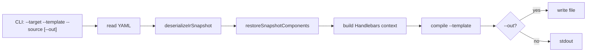

# IR snapshot YAML からの簡易コード生成（`arcane:summon`）

Date: 2026-08-25 08:18

## Problem / goal

IR snapshot YAML からドメインモデル（現行の editor 相当: `uiDefinition` + `components[]`）を復元し、指定 Handlebars テンプレートで任意コードを生成する CLI が欲しい。

想定呼び出し:

```bash
npm run arcane:summon -- \
  --target primefaces \
  --template ./path/to/template/create-events.js.hbs \
  --source ./path/to/ir-snapshot/ir-snapshot.yaml
```

これは **Export パイプラインではない**。Export は IR → Raw → validate → Writer（shape + `form.hbs` 等）で外部 UI 定義を書く。本 CLI は snapshot を直接テンプレート context にする簡易 codegen。

## Proposed approach（推奨）

薄い CLI + 既存 snapshot 復元の再利用。Handlebars は既に `handlebars` 依存がある。

### 処理フロー



1. `--source` の YAML を読む
2. `deserializeIrSnapshotDocument` で envelope 検証（`version` / `savedAt` / `components`）
3. `restoreSnapshotComponents` で永続化除外キーを落とし `id` を再採番（editor の `readLatestSnapshot` と同じ）
4. `--target` と復元結果から Handlebars context を組む
5. `--template` を **ファイルシステム上の明示パス** として compile（`app.io.export.templates.<target>.dir` は使わない）
6. `--out` があれば書き出し、省略時は stdout

### CLI 契約

| 引数 | 必須 | 意味 |
|---|---|---|
| `--target` | はい | context に載せる targetId。MVP では opaque な文字列（Writer / Raw 変換はしない） |
| `--template` | はい | `.hbs` のパス（cwd 相対または絶対） |
| `--source` | はい | IR snapshot YAML ファイル |
| `--out` / `-o` | いいえ | 出力ファイル。省略時は stdout |
| `--help` | いいえ | 用法 |

`--source` がディレクトリのとき最新 `ir-snapshot-*.yml` を選ぶ、は **後回し**（`ir-snapshot-io` の autoSave 設定に依存させないため）。

未知 `--target` を Export registry で reject するかは open（後述）。MVP は非空文字列なら受理を推奨。

### Handlebars context（MVP）

テンプレートから見える形を固定する（ネストを増やしすぎない）:

```ts
{
  target: string;           // --target
  version: number;          // snapshot.version
  savedAt: string;
  uiDefinition: object;     // 欠落時は空メタ相当
  components: unknown[];    // restore 済み（id 再採番）
  comments?: Record<string, string>; // YAML 運用コメント。不要なら載せない選択可
}
```

`external['<targetId>']` の解釈・shape は **しない**。テンプレートが `{{#each components}}` や `external` を直接参照する。target 別の flatten helper は 2 本目のテンプレートで必要になってから。

Helper は最小: 既存 Export と同じ `eq` のみ。`json` / `camelCase` 等は必要になってから。

### 既存モジュールとの境界

| 使う | 使わない |
|---|---|
| `src/lib/ir/snapshot.ts`（deserialize / restore） | `exportFromEditorState` / `DefinitionWriter` / shape |
| `handlebars`（明示パスを compile） | `serializeHandlebarsTemplate`（export テンプレ dir + `$env` 設定が前提） |
| （任意）運用コメント map | Raw Zod 検証 |

`serializeHandlebarsTemplate` を避ける理由:

- テンプレ根が `application.yml` の export dir 固定
- `loadApplicationConfig()` → `$env/dynamic/private` が CLI に要る
- ユーザー例の `create-events.js.hbs` は Facelet 用 `form.hbs` とは別系統

Handlebars の compile キャッシュ / `eq` を共有したくなったら、`$env` 無しの `renderHandlebarsFile(absPath, context)` を `serialize-handlebars.ts` から切り出す。MVP では CLI 側で `Handlebars.create()` + `eq` でも足りる。

### 実行方法（`$lib` 解決）

復元ロジックは `$lib/...` の TypeScript。現行 `scripts/*.mjs` から直接 import できない。`--experimental-strip-types` や自前 loader はプロジェクトの安定 API 方針に反するので使わない。

**推奨:** コアを `src/lib/server/codegen/` に置き、CLI は `tsx`（または `vite-node`）で起動する。いずれも **直接の devDependency 追加** が必要（`package.json` 承認待ち）。

`tsx` は `.svelte-kit/tsconfig.json` の `$lib` paths を使える想定。CLI は `$env` を引くモジュール（`application-config.ts`、Export Writer、logger 経由の config）を import しない。

代替（依存追加なし）: `scripts/arcane-summon.mjs` が `yaml` + `nanoid` + `handlebars` だけで parse/restore を再実装。復元規約の drift リスクがあるので非推奨。

### 配置

| 項目 | 案 |
|---|---|
| npm script | `"arcane:summon": "tsx ./scripts/arcane-summon.ts"` |
| CLI | `scripts/arcane-summon.ts`（argv / fs / exit code） |
| オーケストレーション | `src/lib/server/codegen/summon.ts`（restore + context + render。vitest 可） |
| テンプレ | リポジトリ内の任意パス。慣例案: `templates/codegen/<target>/`（必須ディレクトリにはしない） |
| テスト | `src/lib/server/codegen/summon.spec.ts`（fixture YAML + 小さな hbs） |

`src/lib/ir/` にはテンプレ描画も fs も置かない。`server/io/writers/` にも載せない（Export Writer の変更理由と混ぜない）。

## Alternatives

| 案 | 内容 | 評価 |
|---|---|---|
| A. snapshot 復元 → 明示 hbs（推奨） | 上記 | 要件に対して最小。Export と干渉しない |
| B. Export Writer 再利用 | `--template` を Writer に渡す | Writer は Raw + shape + `form.hbs` 前提。JS 生成に不向き |
| C. snapshot → transform → Raw → hbs | target の transport 形で描画 | 「ドメインモデル復元」より重い。shape 方言がテンプレに漏れる |
| D. target 別 context プラグイン | `primefaces` 用 builder | 3 本目まで YAGNI |

## Key decisions / open questions

1. **`--out` 省略時:** stdout（推奨）か、source 隣への自動ファイル名か
2. **`--target` の厳密さ:** 任意文字列か、`primefaces` / `im-forma` のみか
3. **context に `comments` を載せるか:** コード生成に使うなら載せる。不要なら MVP から外す
4. **ランナー:** `tsx` vs `vite-node`（どちらも package.json + lockfile の承認が必要）
5. **`--source` ディレクトリ:** 最新 snapshot 自動選択を初回に入れるか
6. **テンプレ根の fallback:** パスが無ければ `templates/export/<target>/` を探すか（設定 `$env` が要るので MVP ではやらない推奨）

## Out of scope（初期）

- Export / Preview / HTTP API からの呼び出し
- 複数テンプレートの一括生成、watch
- target 固有 Handlebars partial（`components/*.hbs` の合成）
- IR クラス階層（`IRDefinition` / `Component`）への hydrate（現状 snapshot は plain object）
- プラグイン / イベントバス
- `arcane:diff` / `arcane:grep` / `arcane:inspect`（コマンド自体は未実装。load モジュールだけ先に共有）

## Resolution (2026-08-25 実装時)

- `--out` 省略時は stdout。警告は stderr（欠落 target でも exit 0）
- `--target` は任意文字列。uiDefinition にも components にも `external[target]` が無いとき 1 行警告
- context に運用コメントは載せない。`external` は指定 target の袋だけ（画面レベル + 各 component）
- ランナーは `tsx` + `scripts/tsconfig.json`（`$lib`）
- 配置: `src/lib/server/arcane/load-snapshot.ts` を将来の diff / grep / inspect の入力にし、target 投影は `summon.ts` に閉じる
- `package.json`: `"arcane:summon"` と devDependency `tsx`。lockfile は `npm install` 待ち
