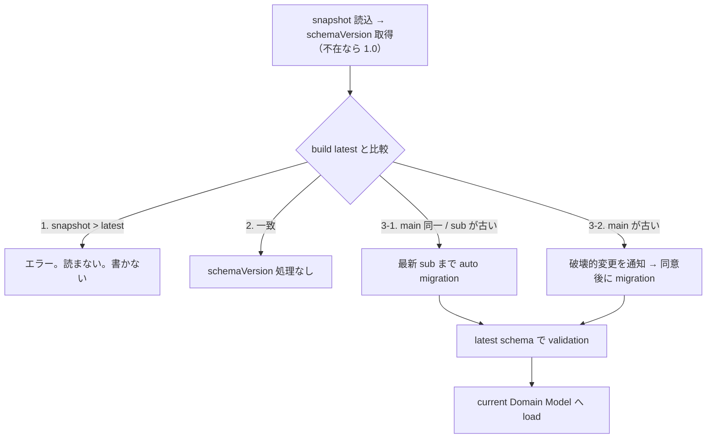
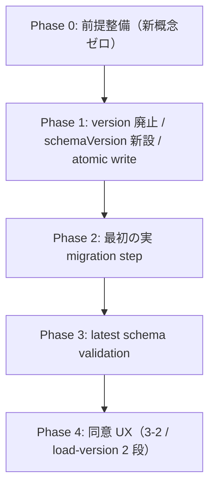

# IR snapshot schemaVersion と migration

Date: 2026-09-07 03:02

## Problem

UI 定義 IR は `snapshot.yml` への serialize / deserialize に対応しているが、snapshot の schema version 管理と、読み込み時の構造的・意味的な検証を行っていない。今後 Domain Model を変更しながら既存 snapshot 資産との互換性を維持する手段がない。

## Goal

- Domain Model を過去 schema 互換のために複雑化させない
- 過去の snapshot を current Domain Model で利用可能にする
- 機械的に安全な変換は自動 migration する
- 意味的・構造的に大きな変更ではユーザーの明示的な意思確認を行う
- migration と schema validation を別責務として扱う
- migration 失敗によって既存 snapshot を破損させない

## D0. version 概念の整理

snapshot には既に 2 種の `version` キーがある。**片方を廃止し、`schemaVersion` を新設する。**

| キー | 意味 | 扱い |
|---|---|---|
| `uiDefinition.version`（`<main>.<sub>`） | ユーザ意図の画面定義に対する版管理。GUI から遷移し `versions/<v>/` の由来。`src/lib/ir/snapshot-version.ts` が所有 | **保持（無変更）** |
| envelope root `version: 1`（`IR_SNAPSHOT_VERSION`） | snapshot コンテナ形式の版 | **廃止** |
| root `schemaVersion`（`<main>.<sub>`） | UI IR 定義の構造的な版管理 | **新設** |

### 廃止の裏付け

`IR_SNAPSHOT_VERSION` は `src/lib/ir/snapshot.ts` の 6 行に閉じており、一度も increment されておらず migration も持たない。実質「LIRM の snapshot か」の sanity check にしかなっていない。

しかも唯一の実消費者が誤解を生んでいる。`templates/cli/summon/primefaces/create-table.sql.hbs`:11 は

```text
-- snapshot version={{version}} savedAt={{savedAt}}
```

を出力するが、この `{{version}}` は envelope 版なので生成 SQL には常に `version=1` が出る。テンプレート作者が期待する製品版（`{{uiDefinition.version}}`）ではない。廃止して `schemaVersion` を出す方が、生成物の provenance として意味を持つ。

なお `templates/export/primefaces/form.hbs`:4 の `{{version}}` は Raw export context の製品版であり別物。**影響しない。**

### 廃止に伴う波及範囲

| 対象 | 要点 |
|---|---|
| `src/lib/ir/snapshot.ts` | `IR_SNAPSHOT_VERSION` 定数、`IrSnapshot.version`、`RestoredIrSnapshot.version`、`createIrSnapshot`、`parseIrSnapshot` の gate |
| `scripts/lib/summon.ts`:19,108 | `SummonTemplateContext.version: number` を `schemaVersion: string` へ置換（Handlebars 公開契約の変更） |
| `templates/cli/summon/primefaces/create-table.sql.hbs`:11 | `schemaVersion=` へ |
| `IrProjectionView` | `RestoredIrSnapshot` を継承していれば連鎖 |
| spec | `snapshot.spec.ts` / `ir-snapshot-io.spec.ts` / `summon.spec.ts` / `summon-samples.spec.ts` / `summon-cli.spec.ts`（`version: 1` fixture） |

### sanity check の代替

`version` の gate を外しても、`parseIrSnapshot` の既存チェック（root が mapping / `savedAt` が非空 string / `components` が配列）で「LIRM snapshot か」は十分判定できる。gate を失わない。

## D1. `schemaVersion` は envelope root

```yaml
schemaVersion: "1.0"    # UI IR 構造（新設）— version: 1 を置き換える
savedAt: "..."
uiDefinition:
  version: "1.3"        # 画面定義の製品版（保持・不変）
  logicalId: ...
components: [...]
```

`uiDefinition` の内側に置かない理由が 2 つある。

1. **scope が足りない。** migration は `components[]` の形も変える。`components[]` は `uiDefinition` の子ではなく兄弟なので、`uiDefinition.schemaVersion` は兄弟の構造を記述できない。UI IR は `{ uiDefinition, components }` の対であり、構造版は対の外側に置く。
2. **投影チェーンを汚す。** `schemaVersion` は editor / live / vendor のどの投影にも属さない第 4 分類になり、`src/lib/ir/ui-definition-meta.ts` 全体へ例外が波及する。root なら `UiDefinitionSnapshotMeta` は**完全に無変更**で済む。

2 は仮説ではない。未追跡 WIP の `src/lib/ir/ui-definitions/v1.0/ui-definition-meta.ts`:35 が `UiDefinitionSnapshotMeta` に `schemaVersion: string` を必須で足した結果、`buildSnapshotMetaForWrite` / `buildPublishedSnapshotMeta` の戻り値が必須プロパティを満たさず `npm run check` が通らなくなっている。root 配置はこの詰まりの回避策そのもの。

付与位置は `createIrSnapshot` — 廃止する `version: IR_SNAPSHOT_VERSION` と同じ場所で、現行ビルドの定数として書く。Domain Model 側は `schemaVersion` を一切知らない。

## D1b. 表記は `<main>.<sub>`、`snapshot-version.ts` は流用しない

同意可否は `main` の差分から**導出**する（D3 の分類に一致）。step 側に `consent` フィールドは持たない。

必須の制約: `parseSnapshotVersion` / `compareSnapshotVersions` / `assertSafeVersionPathSegment` を `schemaVersion` に流用しない。製品版の関数を借りると 2 概念が code 上で融合する。`schemaVersion` 専用の parse / compare を持つ。

## D1c. `schemaVersion` 不在 = baseline、旧 `version` キーは無視して落とす

既存の `data/ir` 配下と `versions/` 配下の全ファイルは `version: 1` を持ち `schemaVersion` を持たない。移行は **migration step ではなく parse の既定値**で処理する。

- `schemaVersion` 不在 → baseline `1.0` として扱い、失敗させない
- 旧 `version` キーが残っていても無視し、次回書き込み時に落とす

これで step 一覧は Phase 1 の時点で**空のまま**にでき、既存資産は 1 行の migration コードも必要としない。

付随して確認すべき影響:

- `SNAPSHOT_YAML_PREFERRED_KEYS` へ `schemaVersion` を追加（キー順の決定性維持）
- serialize 出力が変わるため、既存 snapshot は初回保存時だけ `isSameAsCurrentSnapshot` で差分ありとなり、`schemaVersion` 付きで書き直され history が 1 件増える（無害）

## D2. migration step は Domain 型を知らない plain record 関数

```typescript
type IrSnapshotMigrationStep = {
	/** `<main>.<sub>` */
	from: string;
	to: string;
	/** 採番の判断根拠（なぜ main を上げたか / なぜ sub に留めたか） */
	rationale: string;
	migrate: (record: Record<string, unknown>) => Record<string, unknown>;
};
```

`migrate` が Domain 型を一切 import しないことが、「Domain Model の pure さ維持」と「互換性責務が Domain へ逆流しない」を構造的に保証する要点。`<version>/` 配下に Domain のコピーを置く必要がなくなる。

制約として明記: **component `id` に依存した step は書けない**。`createIrSnapshot` が書き込み時に `id` を strip し、`restoreSnapshotComponents` が読み込み時に `nanoid(16)` で再生成するため。step は位置・構造ベースのみ。

配置:

```text
src/lib/ir/snapshot-migration.ts               公開 API: migrateIrSnapshotRecord(record)
src/lib/ir/snapshot-migrations/1.0-to-1.1.ts   純粋な record → record（step が実在してから作る）
```

呼び出し側は `migrateIrSnapshotRecord` のみを知り、step の解決と適用順は module 内部（`.cursor/rules/13-api-encapsulation.mdc`）。

## D3. 読み込み時の 4 分類



補足として決めた点:

- **chain が複数の main 境界を越える場合**（`1.7 → 2.0 → 3.0`）、確認は 1 回にまとめるが、確認ダイアログには通過する全 ask step の `rationale` を列挙する。これが D2 で `rationale` を step に持たせる理由
- **step が失敗した場合** — read 時の migration はメモリ上のみなので、abort して load しない。元ファイルは無変更。これが「migration 失敗で既存 snapshot を破損させない」の主たる担保
- **case 1（未来 schema）** は migration ではなく明確に区別された loud な失敗。branch を戻した際に現実的に起きる（`.articles/2026-09-04.md` に branch 切り替え起因の再発事例あり）

## D4. 決定は read、write は検証と拒否のみ

検討時の案「auto snapshot 時に `schemaVersion` を比較し、異なれば auto migration 試行 → 同意確認 → auto snapshot」は、**安全性の意図は採用し、実行位置を read に寄せる**。

write 起点で migration を走らせない理由: auto-save が発火する時点で snapshot は既に editor へ読み込まれ、ユーザは編集済み。in-memory 状態は旧ファイル由来なので、ディスク側を migration してから in-memory 状態で上書きしても意味がない。そもそも旧構造を current Domain Model は忠実に表現できない（だから read で migration する）。

一方で **auto-save が migration を黙って永続化してはならない**という懸念は本質的で、write 側にも check を置く。`writeSnapshotUnchecked` は既に `readPersistedSnapshotMeta` と `isSameAsCurrentSnapshot` で `current` を読んでいるので、`schemaVersion` の比較コストはゼロ。

| ディスク側 `schemaVersion` | 動作 |
|---|---|
| == build latest | 既存の流れ |
| 古い | この write が migration の commit。元ファイルを `history/` へ退避してから atomic write |
| **新しい** | **書き込み拒否**（stale なタブ / 古いサーバが新しいファイルを潰す事故を防ぐ。case 1 の write 側担保） |
| 不在 | baseline 扱い（latest が `1.0` なら通常フロー） |

同意待ち / 拒否状態では `src/lib/store/layout-editor/ir-auto-save.svelte.ts` を止め、加えて `POST /api/ir/snapshot` 側でも拒否する（stale client への defense in depth）。

`src/lib/server/io/ir-snapshot-io.ts`:426 の

```typescript
await writeFile(currentFile, yamlText, { encoding: 'utf8' });
```

という無条件上書きを temp + `rename` の atomic 化に変える。migration に限らず**全 auto-save**を保護する。現状 `history/` と `versions/` の `flag: 'wx'` は衝突検出であって atomicity ではない。

## D5. 確定版ロードは共有 parse 地点で自動的に統一される

migration を `toLoadedIrSnapshot` / `deserializeIrSnapshotDocument`（全読込経路の choke point）に置くと、`readLatestSnapshot` と `loadPublishedVersion` の双方が同じ挙動になる。**構造的に統一され、分岐を書く必要がない。**

`loadPublishedVersion` は `versions/<v>/snapshot.yml` を読んで `current` へ**再 serialize する**既存構造なので、migration 結果は `current` にだけ落ち、`versions/<v>/` は旧 schema のまま不変で残る（`publishSnapshot` は `flag: 'wx'` で上書き不可）。過去確定版を patch（sub++）/ new HEAD（main++ & sub=0）する既存仕様はそのまま動く。

この経路で決めた点が 2 つある。

1. **backup は不要。** 元ソース `versions/<v>/snapshot.yml` は不変で、書き込み先は `current` のみ。元ファイルは定義上安全。`loadPublishedVersion` が `clearHistoryDir` を呼ぶことと backup の順序問題は発生しない
2. **main migration の同意は 2 段が必要。** `POST /api/ir/snapshot/load-version` は即 `current` を書くので、同意が必要なら `current` を書かずに 409 + migration 情報を返し、client が確認後 `{ confirmMigration: true }` で再 POST する

副作用として `versions/` ツリーは schema version が混在する。したがって版一覧の `peekChangeReasonFromSnapshotYaml`（現状も parse 失敗を黙って `undefined` にする緩い読み）は schema 混在に耐える必要がある。将来 `changeReason` の位置を変える migration を入れるなら、peek も migration を通すか位置変更を避ける。

## D6. main migration 拒否時は「開かない」

編集は開始せず、原因を示すバナーのみ。ファイルは無変更。

read-only で開く案を採らない理由: export は `exportFromLatestSnapshot` 経由で `current` を読み `transform` → Raw → Writer を通るため、旧 schema の export には旧 schema を理解する transform が必要になり、目的「Domain Model を過去 schema 互換のために複雑化させない」に正面から反する。publish も同様。

「別 logicalId にコピーして開く」案は安全だが、まるごと新しい UX であり最小構成では不要。

## D7. validation は latest schema 1 枚のみ

migration の出力は定義上つねに latest なので、historical schema ファイル群は呼び出し元を持たない。diagnostic は既存の `{ path, message }[]` 契約（`src/lib/schema/raw-validation-error.ts`）を再利用する。

semantic validation は**層を作らない**。`.cursor/rules/02-architecture-boundaries.mdc` の「domain validation engine は deferred」と、既存の個別 guard（`isValidLogicalId` / `isValidSnapshotVersion` / `isUiDefinitionMetaReady`）で足りている。責務としては structural と分離するが、実体は今作らない。

## D8. 採番の判断根拠を残す

`main` / `sub` を選んだ理由は step の `rationale` に書く（D2）。同意ダイアログの文面にもこれを使うため、記録と UX が同じ 1 か所に集まる。

## D9. backup は `history/` を再利用（current 経路のみ）

新ディレクトリも保持期間 config も作らない。`pruneSnapshots` の既存 retention に乗せる。確定版ロード経路は D5 の通り backup 不要。

## 現状 Architecture との衝突点（レビュー時の指摘）

| # | 内容 |
|---|---|
| C1 | auto-save が同意なし migration writer になる。`writeSnapshotUnchecked` は `current` を無条件上書きし、`isSameAsCurrentSnapshot` はディスクの旧 schema とメモリの migration 済みモデルを比較するため必ず「差分あり」となる。read path だけの gate では拒否が成立しない → D4 で解決 |
| C2 | `versions/<v>/` は `flag: 'wx'` で上書き不可の不変成果物。in-place migration は `docs/use-cases/layout-editor.md` が明記する不変性を壊す → D5 で解決 |
| C3 | `<main>.<sub>` は製品版 version と表記が衝突する。キー名と階層が分かれたため WARN で足りる水準まで下がったが、`snapshot-version.ts` の流用禁止は必須 → D1b |
| C4 | `src/lib/<ir-type>/<schemaVersion>/` は `.design-logs/2026-09-06-2315-ir-definition-pure-class-split.md`:84 が明示的に否定している（`1.0` フォルダへの集約凍結は「IR スキーマ移行エンジン相当」）→ D2 の plain record step で回避 |
| C5 | schema 層が現在壊れている。`json-schema-loader.ts`:11-14 は `primefaces.schema.yaml` / `im-forma.schema.yaml` を whitelist するが実体は `schemas/raw/primefaces.schema.json` のみ。`.articles/2026-09-07.md`:104 の 14 件 ENOENT がこれ。この上に IR schema を積むと新旧の破損が識別できない → Phase 0 |

## 実装フェーズ



- **Phase 0** — WIP の `src/lib/ir/ui-definitions/v1.0/` を撤去し、`src/lib/server/io/readers/unshape/im-forma-unshape.ts`:2 と `src/lib/server/io/writers/im-forma-writer.ts`:1 を `$lib/ir/ui-definition-meta` へ戻す。`schemas/raw` の whitelist とファイル名不一致を解消。これで `check` / `test` が緑になり以降の変更が識別可能になる
- **Phase 1** — envelope `version` を廃止（D0 の波及範囲すべて）。root `schemaVersion` を新設（`IrSnapshot` 型 / `createIrSnapshot` / `SNAPSHOT_YAML_PREFERRED_KEYS`、`uiDefinition` は無変更）。`parseIrSnapshot` を 4 分類の判定へ。`current/snapshot.yml` を temp + `rename` で atomic 化。write 側 `schemaVersion` check（D4）。step 空の `snapshot-migration.ts` を追加（挙動不変）
- **Phase 2** — 実 schema 変更が来たときに step 1 本 + 旧 fixture YAML のテストを書く
- **Phase 3 / 4** — latest schema 1 枚、同意 UX。同意が必要な変更が実在してから

## 保留（今回対象外）

per-version schema ファイル、semantic validation 層、dependency graph つき registry、config 化（自動追従 / 保持期間 / IR type ごとの latest）、CLI からの migration 明示実行、read-only 拒否モード。

IR type ごとの `schemaVersion`（将来 layout IR 等を追加する場合）も対象外。root 単一キーで始め、2 種目の IR kind が実在してから分割を検討する。

## docs 更新について

本スナップショットは**設計記録のみ**でコード変更を含まないため、`docs/` の living docs は更新しない（`.cursor/rules/12-docs-maintenance.mdc` は「実装後」に更新を求める）。

Phase 1 実装時に更新が必要な箇所:

- `docs/use-cases/ir-snapshot-auto-save.md` の「YAML envelope (version = 1)」節 → `schemaVersion` へ差し替え
- `docs/architecture/overview.md` のクラス図 `IrSnapshot { version: number, ... }` → `schemaVersion: string`
- `docs/README.md` の scope 表（「IR スキーマ移行エンジン | 対象外」の粒度見直し。step 空の seam は engine ではない旨）
