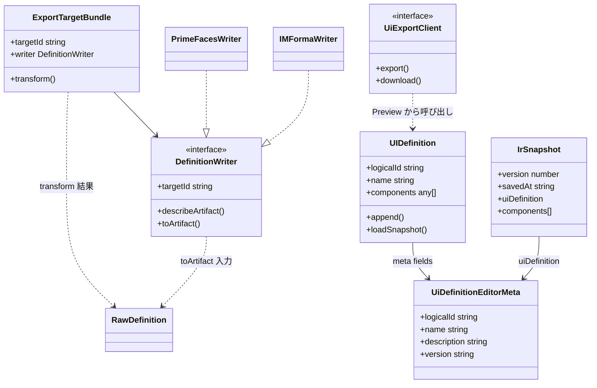

# アーキテクチャ概要

最終更新: 2026-08-09 15:14

## 目的

抽象化された IR（Intermediate Representation）を SSOT（Single Source Of Truth）とし、外部 UI フレームワーク定義への変換・出力を行う。  
GUI 上の編集結果は IR として保持し、形式固有知識は Reader / Writer / Transformer 側に閉じる。

## モジュール配置（`src/lib`）

| Path | 役割 | 現状の主な成果物 |
|---|---|---|
| `ir/` | ドメイン SSOT 周辺 | `ui-definition-meta.ts`, `snapshot.ts`（`IRDefinition` / `Component` クラス階層は今後） |
| `raw/` | 外部形式との中間モデル | `RawDefinition = Record<string, unknown>` |
| `schema/` | 境界での JSON Schema → Zod 検証 | `validate-raw.ts`, `json-schema-loader.ts` |
| `transform/` | IR → Raw（現状は export 方向のみ） | `primefaces-transform.ts`, `im-forma-transform.ts` |
| `server/io/` | ファイル I/O | `ir-snapshot-io.ts`, `definition-export-io.ts`, `writers/`（shape / serialize 含む） |
| `server/ui/` | Export オーケストレーション | `export-pipeline.ts`, `export-target-registry.ts` |
| `server/config/` | `application.yml` 読込 | `application-config.ts` |
| `store/layout-editor/` | 画面向け状態 | `layout-editor.svelte.ts` ほか |
| `components/` | Svelte UI ウィジェット | Preview / 属性表 / パレット等 |

依存の原則:

- `RawDefinition` は Reader / Writer に依存しない
- IR（ドメイン）は外部 UI フレームワーク定義に依存しない
- 形式固有ロジックは Transformer / Writer（将来 Reader）に閉じる
- `schema/` は `server/config` を import しない（SvelteKit private env を引かない）

## 目標データフロー

### Import（未実装）

```text
外部 UI 定義ファイル
  → DefinitionReader → RawDefinition
  → SchemaValidator（JSON Schema / Zod）
  → Transformer → IR
  → GUI
```

### Export（実装済み）

```text
GUI 編集（IR 相当の store 状態）
  → Transformer → RawDefinition
  → SchemaValidator（JSON Schema / Zod）
  → shape（target 向け transport payload）
  → serialize（json / Handlebars 等）※ DefinitionWriter 内部
  → 外部 UI 定義ファイル（definition-export-io）
```

Shape 後ペイロードは再検証しない（Raw が target Schema を満たし、shape が信頼できる前提）。

## 主要型・クラス関係



補足:

- 画面間の store 共有は **Svelte Context のみ**（`setUIDefinitionContext` / `getUIDefinitionContext`）
- Export の target 解決はサーバ側 `EXPORT_TARGET_REGISTRY` とクライアント側 `UI_EXPORT_CLIENT_REGISTRY` の二系統（薄い HTTP アダプタ）

## 設定

- ベース: `config/application.yml`
- プロファイル上書き: `APP_PROFILE` → `config/application-{profile}.yml`（例: `dev`）
- 必須環境変数: `APP_CONFIG_PATH`
- IO 関連キー:
  - `app.io.exportDir` — 外部 UI 定義の出力ルート（未設定時は export API が 403）
  - `app.io.export.templates.<targetId>.dir` — Handlebars 等テンプレート根（target ごと、差し替え可能）
  - `app.io.importDir` — 予約（YAML ではコメントアウト、利用箇所なし）
  - `ir.autoSave.*` — snapshot 自動保存（主に `application-dev.yml`）
  - `preview.theme` / `preview.transformTarget` — Preview UI 用

相対パスは `process.cwd()` 基準。`npm run` をリポジトリルートから実行する前提。

## 関連ドキュメント

- [レイアウトエディタ](../use-cases/layout-editor.md)
- [IR snapshot](../use-cases/ir-snapshot-auto-save.md)
- [UI Export](../use-cases/ui-export.md)
- [HTTP API](../api/http-endpoints.md)
