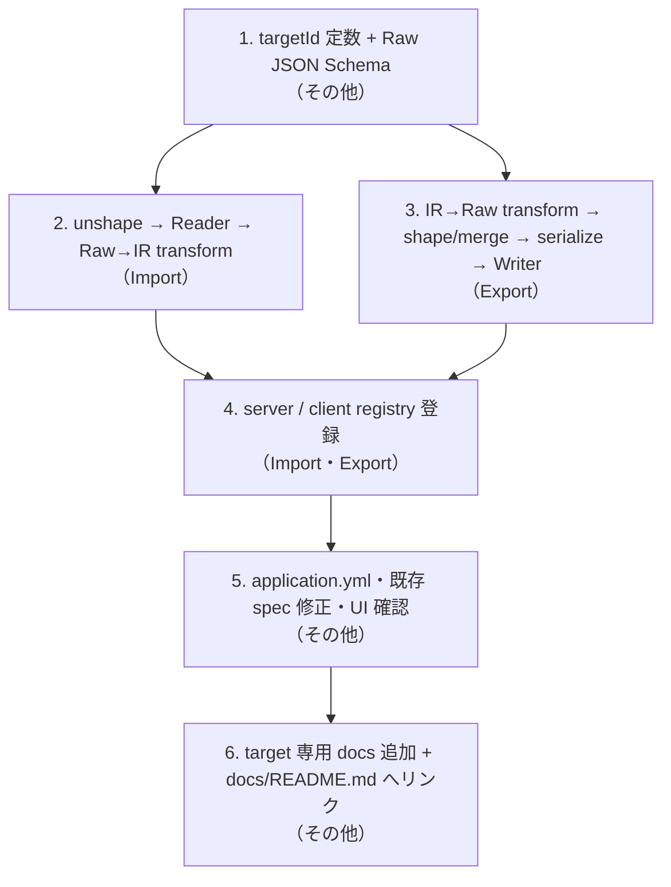

# LIRM 保守運用ガイド（保守者向け）

最終更新: 2026-09-27 04:45

本ディレクトリは **LIRM 自体を改造する人向け** の手順書です。`docs/` の他のディレクトリとは読者が違います。

| 読者 | ディレクトリ | 内容 |
|---|---|---|
| **LIRM 利用者** | `docs/use-cases/`・`docs/api/` | 画面から何ができるか、API 契約、target ごとの取り込み / 出力仕様 |
| **LIRM 保守者** | `docs/maintenance/`（本ディレクトリ） | LIRM を拡張・改訂するときに**どこを触るか**の作業手順 |
| （設計経緯） | `.design-logs/` | 提案スナップショット（追記専用。現行仕様ではない） |

利用者向け文書は「**何が起きるか**」を書きます。本ディレクトリは「**どのファイルをどの順で変えるか**」を書きます。同じ話題でも役割が違うので、片方に寄せずに両方を更新してください。

## 手順書

| ユースケース | 手順書 |
|---|---|
| IR snapshot の構造を変える（`schemaVersion` 改訂） | [schemaVersion 改訂](./schema-version-revision.md) |
| 新しい adapter target の取り込みを作る | [target 追加: Import パイプライン](./add-target-import.md) |
| 新しい adapter target の出力を作る | [target 追加: Export パイプライン](./add-target-export.md) |
| target 追加の残り（schema / config / UI / 既存 spec / docs） | [target 追加: その他対応](./add-target-other.md) |
| `arcane:summon` のコード生成テンプレートを新規作成する | [summon テンプレート新規作成](./add-summon-template.md) |

## target 追加の全体像

target 追加は 3 文書に分かれています。依存順に並べると次のとおりです。**この順に進めれば各段階で型が通ります。**

## 最初に知っておくべき前提

**targetId の union 型は存在しません。** すべて `targetId: string` を `Record<string, …>` に引くだけです。つまり target 追加は完全に追加的で既存の型を壊しませんが、**登録漏れがあってもコンパイルは通ります**。`npm run check` は当てになりません。必ずチェックリストで進めてください。

登録先は独立した registry が 6 つ + YAML 1 箇所あります。一覧は [その他対応](./add-target-other.md#registry-一覧) にまとめてあります。

## ベンダー固有知識の置き場所

本ディレクトリには**手順**だけを書きます。既存 target を「真似る雛形」として file path で参照するのは構いませんが、ベンダー語彙・type マップ・serialize 方言・文書族判定の**中身**は書きません。それらは `docs/use-cases/<targetId>-import.md` / `<targetId>-export.md` に書きます。

この境界は `.cursor/rules/02-architecture-boundaries.mdc` の Core / adapter target 分離と同じ考え方です。
