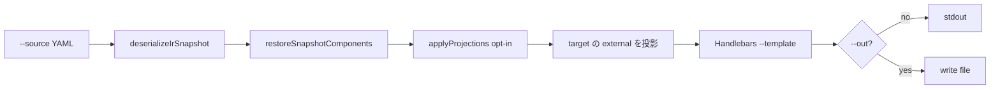

# ユースケース: IR snapshot からの簡易コード生成（`arcane:summon`）

最終更新: 2026-09-01 08:20

## 概要

IR snapshot YAML を editor と同じ手順で復元し、指定した Handlebars テンプレートで任意コードを生成する。

これは **Export ではない**。Export は IR → Raw → 検証 → Writer（shape / `form.hbs` 等）で外部 UI 定義を書く。本 CLI は snapshot をテンプレート context にする。

```bash
npm run arcane:summon -- \
  --target primefaces \
  --template ./templates/cli/summon/primefaces/logical-id-type-label.tsv.hbs \
  --source ./path/to/ir-snapshot.yaml
```

パイプ / リダイレクト向けに、`--out` 省略時の本文は **stdout**。警告は **stderr**（終了コードは 0 のまま）。

## CLI

| 引数 | 必須 | 意味 |
|---|---|---|
| `--target` | はい | context の `target`。任意文字列（Export registry では検証しない） |
| `--template` | はい | `.hbs` パス（cwd 相対または絶対）。export 用テンプレ dir は見ない |
| `--source` / `--src` | はい | IR snapshot YAML **ファイル** |
| `--out` / `-o` | いいえ | 出力ファイル。省略時は stdout（ファイルへは本文を出さない） |
| `--projection` | いいえ | 射影プラグイン id（カンマ区切り）。省略時は射影なし |
| `--bytes-per-char` | いいえ | `db-maxlength` のバイト倍率（正の整数。省略時 3） |
| `--help` / `-h` | いいえ | 用法 |

`--target` の残余が `uiDefinition` にもどの `components[]` 要素にも無いときは stderr へ 1 行警告し、空の `external: {}` で描画を続ける。

未知の `--projection` id はエラー（終了コード 1）。契約は [プラグイン](../architecture/plugins.md)。

```bash
npm run arcane:summon -- \
  --target primefaces \
  --template ./templates/cli/summon/primefaces/create-table.sql.hbs \
  --source ./path/to/ir-snapshot.yaml \
  --projection by-logical-id,db-maxlength \
  --bytes-per-char 3
```

## 処理フロー



運用コメントは読んでも context には載せない。

## Handlebars context

| キー | 内容 |
|---|---|
| `target` | `--target` |
| `version` / `savedAt` | snapshot envelope |
| `uiDefinition` | メタ。`external` は **その target の袋だけ** |
| `components` | restore 済み（`id` 再採番）。各要素の `external` も target 袋だけ |
| `external` | `uiDefinition.external` と同じ（画面レベルの target 袋） |
| `componentsByLogicalId` | `--projection by-logical-id` のときだけ。値の `external` も target 袋だけ |

他 target の残余はテンプレートから見えない。復元直後のフルバッグは `restoreIrSnapshotFromYaml` が保持し、target 投影は `scripts/lib/summon.ts` が行う。射影本体は `$lib/projection`。

`validation.maxlength` は IR の文字数。`--projection db-maxlength` 時だけ同オブジェクトに `validation.dbMaxlength`（バイト換算）が付く。

Helper: `eq`（`{{#if (eq type "textbox")}}`）。ハイフン付き logicalId は組み込み `lookup`。

WARN: Handlebars の `{{ }}` は `false` / `0` を空文字にする。真偽値は `{{#if}}` か文字列化して参照する。

## モジュール

| パス | 役割 |
|---|---|
| `src/lib/ir/snapshot.ts` | YAML 文字列 → 復元済みドメイン |
| `src/lib/projection/` | opt-in 射影（`applyProjections`） |
| `src/lib/server/io/ir-snapshot-file.ts` | 任意パスのファイル読込（autoSave 非依存） |
| `scripts/lib/paths.ts` | cwd 相対 → 絶対パス |
| `scripts/lib/summon.ts` | 射影適用 + target 投影 + Handlebars |
| `scripts/lib/summon-cli.ts` | argv |
| `scripts/arcane-summon.ts` | stdout / `--out` / 終了コード（npm alias エントリ） |
| `scripts/tsconfig.json` | `$lib` 解決（tsx） |

`$env` / `application.yml` / Writer は使わない。`arcane` は npm script 名とエントリファイル名のみ。

## サンプルテンプレート（`templates/cli/summon/primefaces/`）

`--target primefaces` 向けの例。Export 用 `templates/export/primefaces/` とは別。

| ファイル | 出力 |
|---|---|
| `logical-id-type-label.tsv.hbs` | `logicalId` / `type` / `label` の TSV |
| `components.js.hbs` | components を含むオブジェクト宣言と `forEach` + `console.log` |
| `create-table.sql.hbs` | `CREATE TABLE`（`label` 型は列にしない。`validation.maxlength` / opt-in の `dbMaxlength`） |

## 将来の `arcane:*`（未実装）

同じ `RestoredIrSnapshot`（`ir/snapshot.ts` + 任意パス読込）を入力にする想定。npm script と実装はまだ無い。

| script | 想定 |
|---|---|
| `arcane:diff` | snapshot 同士（または世代）の比較 |
| `arcane:grep` | snapshot 内容の検索 |
| `arcane:inspect` | `external` と IR の対応確認 |

## 関連

- [プラグイン（射影）](../architecture/plugins.md)
- [IR snapshot 自動保存](./ir-snapshot-auto-save.md)
- [UI Export](./ui-export.md)（別経路）
