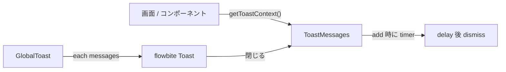

# ユースケース: Global Toast

最終更新: 2026-08-28 07:36

## 概要

PrimeFaces Growl / `FacesMessage` 相当の通知を、アプリ全体で 1 つの Toast 面に出す。  
失敗時の `console.warn` は残し、ユーザー向けには Toast を重ねる。

| JSF / PrimeFaces | 本アプリ |
|---|---|
| `FacesMessage` | `ToastMessage`（`severity` / `summary` / `detail`） |
| `FacesContext.addMessage` | `ToastMessages.add` / `info` / `warn` / `error` |
| `<p:growl>` | `GlobalToast`（ルート `+layout.svelte`） |
| `life` | `DEFAULT_TOAST_DELAY_MS`（5000） |
| `sticky` | メッセージ単位の `sticky` |

## データフロー



- Context はルート `+layout.svelte` で `setToastContext` する（layout-editor 配下に閉じない）。
- 呼び出し側は id / timer を扱わない。
- 自動消去の timer は store の `add` が持つ。Host の `$effect` では張らない。
- `attachIrAutoSave` は debounce コールバック内ではなく、layout 初期化中に `getToastContext()` する。

## 呼び出し

```ts
const toast = getToastContext();
toast.info('保存しました', 'snapshot を更新しました');
toast.warn('未保存の変更があります');
toast.error('Export に失敗しました', error.message);
toast.add({ severity: 'info', summary: '…', sticky: true });
```

`severity` は `info` / `warn` / `error`。表示色は green / yellow / red。

## 差し込み箇所

| 箇所 | Toast | 備考 |
|---|---|---|
| `Preview.svelte` Export / Download | 成功 `info`、失敗 `error` | 画面内 `statusMessage` は廃止 |
| `DefinitionImportModal.svelte` | 成功後 `info` | 失敗はモーダル内 `Alert` のまま |
| `ir-auto-save.svelte.ts` | 保存失敗 `error` | `console.warn` も残す。sticky にはしない |
| `UiDefinitionMetaAccordion.svelte` | 復元失敗 `error`。一覧取得・存在確認失敗 `warn` | 404（未使用 ID）は現状維持のため出さない。`console.warn` も残す |

コメント保存（`MarkdownCommentModal`）はローカル store 更新のみで、失敗経路が無いので対象外。

## 関連実装

| 領域 | パス |
|---|---|
| Store / Context | `src/lib/store/toast/toast.svelte.ts` |
| Host | `src/lib/components/GlobalToast.svelte` |
| 配線 | `src/routes/+layout.svelte` |
