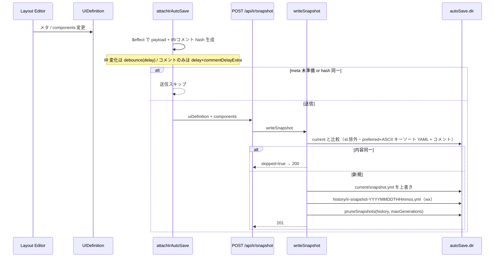

# ユースケース: IR スナップショット自動保存

最終更新: 2026-08-31 08:05

## 概要

編集中の UI 定義を、debounce 付きでサーバ上の YAML snapshot として保存する。  
作業コピーは `current/`、自動保存の世代は `history/`（`maxGenerations` で prune）。確定版は `versions/<main.sub>/`（immutable）。  
外部 UI 形式への変換とは **別経路**（Export とは独立。Export も current を読む）。

前提設定（例: `config/application-dev.yml`）:

```yaml
ir:
  autoSave:
    enabled: true
    delay: 500
    commentDelayExtra: 1500
    dir: ./data/ir
    maxGenerations: 10
```

| キー | 意味 |
|---|---|
| `delay` | Property / Layout（IR メタ + components）変化後の待ち（ms） |
| `commentDelayExtra` | コメント map **のみ** 変化したときに `delay` へ加算する（ms）。省略時 1500。`0` なら IR と同じ |

実効待ちは IR 変化が `delay`、コメントのみが `delay + commentDelayExtra`。両方変わるときは短い `delay` に合流し、payload には最新コメントを載せる。debounce はクライアントのみ。サーバ IO は POST 受信後に即比較・書込する。

運用コメントの下書き（Monaco）は autoSave しない。`#map` に載るのはモーダルの保存と左ツリー切替。

`enabled: false` または未設定のとき、書込 API は 403。logical-ids 一覧は空配列を返す。

## シーケンス



## 二重の重複抑制

| 層 | 比較単位 | 備考 |
|---|---|---|
| クライアント | IR hash とコメント hash（`JSON.stringify`、component `id` を含む） | 変化種別に応じて delay を分ける。連続入力の送信抑制 |
| サーバ | `normalizeSnapshotForCompare` + `normalizeCommentsForCompare` | 意味的に同じ内容の再書込を skip |

そのため、見た目上の reorder や id 再生成だけではサーバ側で skip されることがある。

保存 API が失敗したときは `console.warn` に加え、Global Toast で `error` を出す（sticky にはしない）。

## ファイル配置

```text
<data/ir>/<logicalId>/current/snapshot.yml
<data/ir>/<logicalId>/history/ir-snapshot-YYYYMMDDTHHmmss.yml
<data/ir>/<logicalId>/history/ir-snapshot-YYYYMMDDTHHmmss-2.yml   # 同一秒衝突時
<data/ir>/<logicalId>/versions/1.0/snapshot.yml
<data/ir>/<logicalId>/versions/2.0/snapshot.yml
```

- ディレクトリ名は画面 ID（`logicalId`）。未使用 ID への切替時は確認ダイアログがあり得る（[layout-editor](./layout-editor.md)）
- 編集中の正は常に `current/snapshot.yml`（上書き）。GET / エディタ復元 / snapshot 経由の Export もここを読む
- `history/` は自動保存の世代。prune 対象。復元 UI は無い（手動リストア用）
- `versions/<main.sub>/snapshot.yml` は確定版。上書きしない。version は `<main>.<sub>`（既定 `1.0`。第 3 段は使わない）。ユーザ向けの版識別は **changeReason（+ version）**
- 確定は次の系統。初回のみ確認なしで `1.0`。2 回目以降はダイアログで選ぶ
  - **パッチ**（sub+1）: HEAD 上のメタ修正など、および過去版の修正。HEAD `v5.0` → `v5.1`、過去 `v1.0`（HEAD が `v2.x`）→ `v1.1`
  - **改版**（main+1.0）: HEAD の大きな変更。HEAD `v5.0` → `v6.0`
  - **新たな正本**: 過去版を新 HEAD にする。過去 `v1.0`（HEAD が `v2.x`）→ `v3.0`
- 過去版読込は各 main の最新 sub のみ選べる。選択 UI は `changeReason (version)`。読込時は history をクリアし、`basedOn` に選択元を記録する。current の `createdAt` / `modifiedAt` はそのファイルのライフサイクルで付け直す
- `changeReason` / `releasedAt` / `closedAt` / `closedReason` は current の任意項目。確定時にその版へコピーする。`releasedAt` はユーザのリリース日（`YYYY-MM-DD`）。空ならキー省略（確定時刻では埋めない）。既確定ファイルへの後書き廃止はしない
- 旧レイアウト（`<logicalId>/ir-snapshot-*.yml`）は current が無いときだけ読む。次の保存で current + history へ書く（旧ファイルは移動しない）
- history ファイル名の時刻は **ローカル時刻**
- ファイル内 `savedAt` は ISO UTC
- 画面 ID を変えると別ディレクトリへ保存される。過剰なディレクトリ生成は許容する（復元は ID 単位）
- 世代のソート・prune は **history のファイル名** 基準（mtime ではない）
- 復元時: component `id` を除去して保存 → 読込時に再採番
- `uiDefinition.version` の既定は `1.0`（`<main>.<sub>`。第 3 段は使わない）

## YAML envelope (version = 1)

Output uses eemeli/yaml Document (not js-yaml). Operational Markdown comments are stored as YAML `#` (`commentBefore`):

- `uiDefinition` key: one comment for the meta accordion as a whole
- any path under `uiDefinition` (domain keys such as `logicalId`, and `external…`)
- each `components[]` element: one comment immediately before that element (not before the `components` key)
- any path under a `components[]` element (domain keys and `external…`)

HTTP GET/POST carry a `comments` map (YAML key path → Markdown). The YAML file itself does not have a `comments:` key.

Skip compare includes both IR content and the comment map. Comment-only edits create a new generation.

Key order for every mapping:

1. System meta: version, createdAt, modifiedAt, savedAt
2. Snapshot preferred keys (SNAPSHOT_YAML_PREFERRED_KEYS)
3. Remaining keys in ASCII (UTF-16 code unit) order. This is not natural numeric order.

Envelope shape:

- root: version, savedAt, uiDefinition, components
- uiDefinition: logicalId, name, version, changeReason / releasedAt / closedAt / closedReason（ある場合）, description, basedOn（ある場合）, external last if present, then createdAt, modifiedAt
- components[]: logicalId, type, label, then type-specific keys, then external

createdAt is preserved by buildSnapshotMetaForWrite on first save.

application.yml still loads with js-yaml for now; unify onto eemeli/yaml later.

## 関連 API

| Method | Path | 用途 |
|---|---|---|
| `POST` | `/api/ir/snapshot` | 保存（201 / skip 時 200） |
| `GET` | `/api/ir/snapshot?logicalId=` | 編集中コピー（current。無ければ旧 flat latest） |
| `GET` | `/api/ir/snapshot/logical-ids` | オートコンプリート用一覧 |
| `GET` | `/api/ir/snapshot/versions?logicalId=` | 確定版一覧 / HEAD / 選択候補 / summaries（changeReason） |
| `POST` | `/api/ir/snapshot/publish` | 確定（`mode`: revision / patch / new-head） |
| `POST` | `/api/ir/snapshot/load-version` | 確定版を current へ載せ history をクリア |

## 関連実装

| 領域 | パス |
|---|---|
| クライアント | `src/lib/store/layout-editor/ir-auto-save.svelte.ts` |
| IO | `src/lib/server/io/ir-snapshot-io.ts` |
| メタ / snapshot 型 | `src/lib/ir/ui-definition-meta.ts`, `src/lib/ir/snapshot.ts`, `src/lib/ir/snapshot-comment-map.ts` |
| YAML key sort / comments | `src/lib/utils/object-key-sort.ts`, `src/lib/utils/yaml-document.ts`, `src/lib/utils/yaml-comments.ts` |
