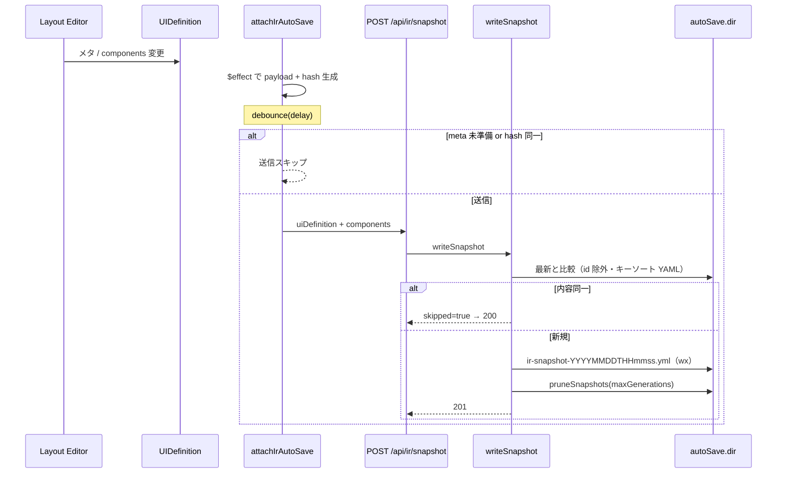

# ユースケース: IR スナップショット自動保存

最終更新: 2026-08-12 09:30

## 概要

編集中の UI 定義を、debounce 付きでサーバ上の YAML snapshot として世代管理する。  
外部 UI 形式への変換とは **別経路**（Export とは独立）。

前提設定（例: `config/application-dev.yml`）:

```yaml
ir:
  autoSave:
    enabled: true
    delay: 500
    dir: ./data/ir
    maxGenerations: 10
```

`enabled: false` または未設定のとき、書込 API は 403。logical-ids 一覧は空配列を返す。

## シーケンス



## 二重の重複抑制

| 層 | 比較単位 | 備考 |
|---|---|---|
| クライアント | `buildSaveHash`（`JSON.stringify`、component `id` 含む） | 連続入力の送信抑制 |
| サーバ | `normalizeSnapshotForCompare`（`id` 除去 + `sortKeys` YAML） | 意味的に同じ内容の再書込を skip |

そのため、見た目上の reorder や id 再生成だけではサーバ側で skip されることがある。

## ファイル配置

```text
<data/ir>/<logicalId>/ir-snapshot-YYYYMMDDTHHmmss.yml
<data/ir>/<logicalId>/ir-snapshot-YYYYMMDDTHHmmss-2.yml   # 同一秒衝突時
```

- ディレクトリ名は画面 ID（`logicalId`）。未使用 ID への切替時は確認ダイアログがあり得る（[layout-editor](./layout-editor.md)）
- ファイル名の時刻は **ローカル時刻**
- ファイル内 `savedAt` は ISO UTC
- 画面 ID を変えると別ディレクトリへ保存される。過剰なディレクトリ生成は許容する（復元は ID 単位）
- 世代のソート・prune は **ファイル名** 基準（mtime ではない）
- 復元時: component `id` を除去して保存 → 読込時に再採番

## YAML エンベロープ（version = 1）

- `version`, `savedAt`
- `uiDefinition`: `logicalId`, `name`, `description`, `version`, `createdAt`, `modifiedAt`
- `components[]`

`createdAt` は初回作成を `buildSnapshotMetaForWrite` が維持する。

## 関連 API

| Method | Path | 用途 |
|---|---|---|
| `POST` | `/api/ir/snapshot` | 保存（201 / skip 時 200） |
| `GET` | `/api/ir/snapshot?logicalId=` | 最新 1 件取得 |
| `GET` | `/api/ir/snapshot/logical-ids` | オートコンプリート用一覧 |

## 関連実装

| 領域 | パス |
|---|---|
| クライアント | `src/lib/store/layout-editor/ir-auto-save.svelte.ts` |
| IO | `src/lib/server/io/ir-snapshot-io.ts` |
| メタ / snapshot 型 | `src/lib/ir/ui-definition-meta.ts`, `src/lib/ir/snapshot.ts` |
