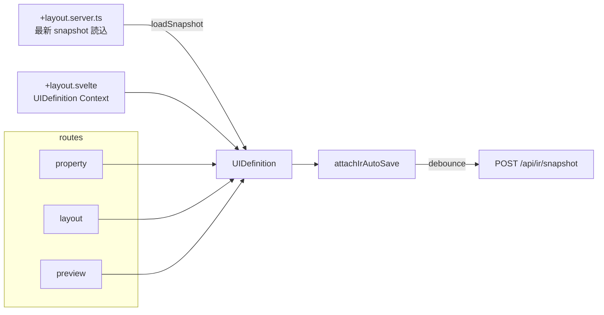
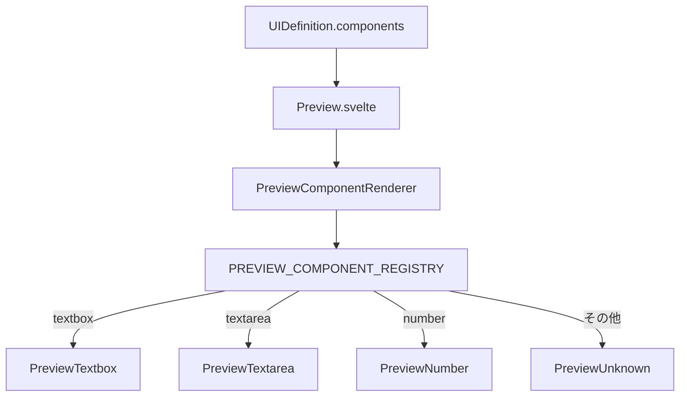

# ユースケース: レイアウトエディタ編集

最終更新: 2026-08-09 00:36

## 概要

`/layout-editor` 配下で UI 定義メタとコンポーネント一覧を編集する。  
エントリ `/layout-editor` は `/layout-editor/property` へリダイレクトする。

| 画面 | パス | 主な操作 |
|---|---|---|
| Property | `/layout-editor/property` | コンポーネント追加・属性編集・論理 ID 確定 |
| Layout | `/layout-editor/layout` | 並べ替え（DnD） |
| Preview | `/layout-editor/preview` | 見た目確認・Export / Download |

## アクターと成功条件

- **アクター**: プロトタイプ作成者（ローカル開発者）
- **成功**: メタ（`logicalId` / `name` 等）とコンポーネント列が Context 上の `UIDefinition` に反映され、他タブ・自動保存・Export から参照できる

## 画面構成データフロー

## メタ編集と既存画面の読込

`UiDefinitionMetaAccordion` で `logicalId` を blur / オートコンプリート確定したとき:

1. `GET /api/ir/snapshot?logicalId=…` を呼ぶ
2. 見つかれば store をその snapshot で置換
3. **404 は無視**（新規 logicalId として現在の components を維持＝「既存画面をコピーして別名保存」用途）

`logicalId` の妥当性は `isValidLogicalId`（`/^[a-zA-Z][a-zA-Z0-9_-]*$/`）。  
パスセグメントとしても同じ制約（`assertSafeLogicalIdPathSegment`）で traversal を防ぐ。

## プレビュー描画

- テーマは `preview-theme--{value}` クラス + `preview-theme-styles.ts`
- Export / Download ボタンは `isUiDefinitionMetaReady` かつ非 busy のときのみ有効

## コンポーネント種別（現状）

Factory関数: `createTextbox` / `createTextarea` / `createNumber`  
共通フィールド例: `id`, `type`, `logicalId`, `label`, `validation` など。  
`id` は編集セッション用。snapshot 保存時は除去し、読込時に `nanoid` で再生成する。

## 関連実装

| 領域 | パス |
|---|---|
| Store | `src/lib/store/layout-editor/layout-editor.svelte.ts` |
| Layout shell | `src/routes/layout-editor/+layout.svelte` |
| 初期読込 | `src/routes/layout-editor/+layout.server.ts` |
| Preview | `src/lib/components/Preview.svelte` |
