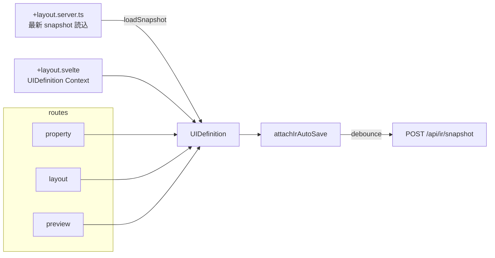
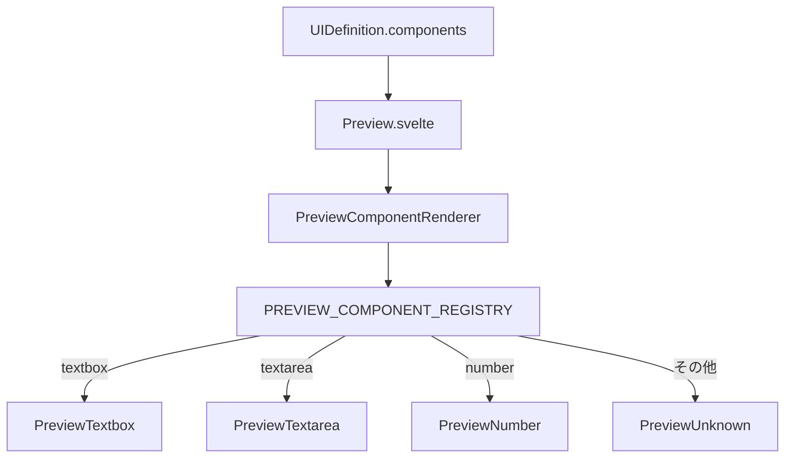

# ユースケース: レイアウトエディタ編集

最終更新: 2026-08-12 09:30

## 概要

`/layout-editor` 配下で UI 定義メタとコンポーネント一覧を編集する。  
エントリ `/layout-editor` は `/layout-editor/property` へリダイレクトする。

| 画面 | パス | 主な操作 |
|---|---|---|
| Property | `/layout-editor/property` | コンポーネント追加・属性編集・論理 ID 確定 |
| Layout | `/layout-editor/layout` | 並べ替え（DnD） |
| Preview | `/layout-editor/preview` | 見た目確認・Export / Download |

## アクターと成功条件

- **アクター**: プロトタイプ作成者（ローカル開発者）
- **成功**: メタ（`logicalId` / `name` 等）とコンポーネント列が Context 上の `UIDefinition` に反映され、他タブ・自動保存・Export から参照できる

## 画面構成データフロー

## メタ編集と既存画面の読込

`UiDefinitionMetaAccordion` で画面 ID（内部名 `logicalId`）を blur / オートコンプリート確定したとき:

1. `GET /api/ir/snapshot?logicalId=…` を呼ぶ
2. 見つかれば store をその snapshot で置換
3. **404（未使用 ID）** のとき、設定に応じて確認ダイアログを出し、続行後に現在の components を維持したまま ID だけ切り替える（「既存画面をコピーして別名保存」用途）

定義インポート後も、取り込み結果の画面 ID が未使用なら **同じ確認ダイアログ** を出す（手動変更と共通）。

### 未使用画面 ID の確認ダイアログ

| 項目 | 内容 |
|---|---|
| 表示条件 | 画面 ID が変わり、かつその ID の snapshot が無く、かつ確認が有効なとき |
| 設定 | `layoutEditor.property.confirmSnapshotDirCreation`（既定 `true`） |
| 「次回以降確認しない」 | ブラウザ `localStorage`（`layout-editor.skipConfirmSnapshotDirCreation`）。application.yml は書き換えない |
| キャンセル | ID 変更／取り込みを取り消し |

`logicalId` の妥当性は `isValidLogicalId`（`/^[a-zA-Z][a-zA-Z0-9_-]*$/`）。  
パスセグメントとしても同じ制約（`assertSafeLogicalIdPathSegment`）で traversal を防ぐ。

## Property: 編集可能な項目のみ

属性表上部の Toggle「編集可能な項目のみ」（既定 ON）で、ファクトリ登録済み type だけを一覧表示する。  
OFF にすると非対応 type（パススルー）も含めて全件表示する。Layout / Preview の表示方針とは独立。

## プレビュー描画

- テーマは `preview-theme--{value}` クラス + `preview-theme-styles.ts`
- Export / Download ボタンは `isUiDefinitionMetaReady` かつ非 busy のときのみ有効

## Property 属性テーブル

`ComponentAttributeTable` で `UIDefinition.components` を行編集する。

- **常時表示列**: 行選択 / `logicalId` / `type` / `label`
- **列グループ切替**（presentation state。IR / snapshot には載せない）: `Basic` | `Details` | `Validation`（関心別。type 名では増やさない）
- Details / Validation は **固定スロット列**（行ごとに td 数が変わらない）。ヘッダは `colspan` でグループ名のみ表示する。

| グループ | 追加列 | 編集対象（列位置に type 別フィールドを載せる） |
|---|---|---|
| Basic | hint / required / readonly / disabled | 共通フラグ・hint。非対応は `- not supported -` |
| Details | details-0..1（2 固定） | 0: items \| format \| cols、1: rows |
| Validation | validation-0..2（3 固定） | 0: pattern \| maxlength \| min \| minDate / minDateTime(date)…、1: minlength \| max \| maxDate / maxDateTime(date)…、2: textbox maxlength。datetime は同セル内に Datepicker + Timepicker（時刻は `validation-N-time`） |

### 矢印キーナビ（`arrowNavigation`）

- 各入力は一意の `field`（`details-N` / `validation-N` 等）を持つ。Details / Validation スロットは `fieldGroup`（`details` / `validation`）も付与する。
- **左右**: 同一行の focusable のみ。テキストおよび `date` / `time` 等は、先頭で左 2 連続・末尾で右 2 連続、または Ctrl+左右でセル遷移（1 回では遷移しない）。datetime 境界は `datetime-local` ではなく Datepicker（text）+ Timepicker を並べ、日付側は Selection API で終端判定する。
- **Datepicker カレンダー**: フォーカスで開くが blur では閉じない（Flowbite 仕様）。セル外へフォーカスが移ったら outside-click 相当で閉じ、下行編集を遮らない。
- **上下（fieldGroup あり）**: 最寄り行で同 group の入力がある行へ着地 → 同行内で同 `field` → なければ ordinal / 先頭。遠い行の同 field へ飛ばない。
- **上下（fieldGroup なし / Basic）**: 同 `field` の最寄り行（未対応行はスキップ）。

日付系 IR の SSOT は `format` のみ（`placeholder` は持たない）。PrimeFaces export 時の HTML `placeholder` は shape が `format` の英字トークンを `_` マスク化した文字列を導出する。

`TagsInput` は IR 非依存（Enter / カンマで追加、Badge で削除）。`data-arrow-nav-focus` により外側の `arrowNavigation` が削除ボタンではなく入力へフォーカスする。

items 表記は `${value}${itemDelimiter}${label}`（同一なら区切りなし）。`itemDelimiter` は `config/application.yml` の `layoutEditor.property.itemDelimiter`（既定 `|`）。

## コンポーネント種別（現状）

Factory: `createTextbox` / `createTextarea` / `createNumber` / `createCheckbox` / `createRadio` / `createDropdown` / `createDropdownMulti` / `createDatepicker` / `createDateSpan` / `createDatetimepicker` / `createTimepicker` / `createLabel` など。  
共通フィールド例: `id`, `type`, `logicalId`, `label`, `validation` など。  
`id` は編集セッション用。snapshot 保存時は除去し、読込時に `nanoid` で再生成する。

## 関連実装

| 領域 | パス |
|---|---|
| Store | `src/lib/store/layout-editor/layout-editor.svelte.ts` |
| Layout shell | `src/routes/layout-editor/+layout.svelte` |
| 初期読込 | `src/routes/layout-editor/+layout.server.ts` |
| 属性テーブル | `src/lib/components/ComponentAttributeTable.svelte` |
| Details セル | `src/lib/components/ComponentDetailsCell.svelte` |
| Validation セル | `src/lib/components/ComponentValidationCell.svelte` |
| TagsInput | `src/lib/components/TagsInput.svelte` |
| Preview | `src/lib/components/Preview.svelte` |
