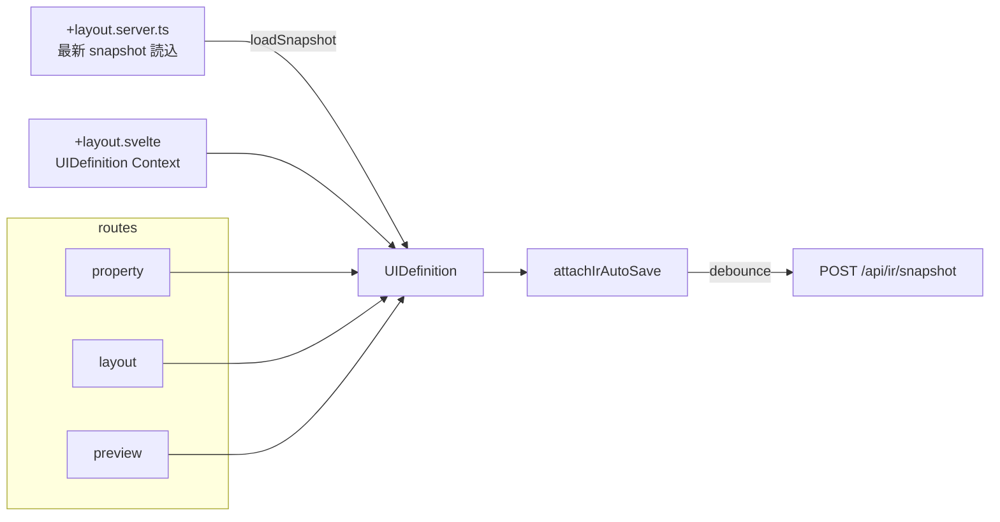
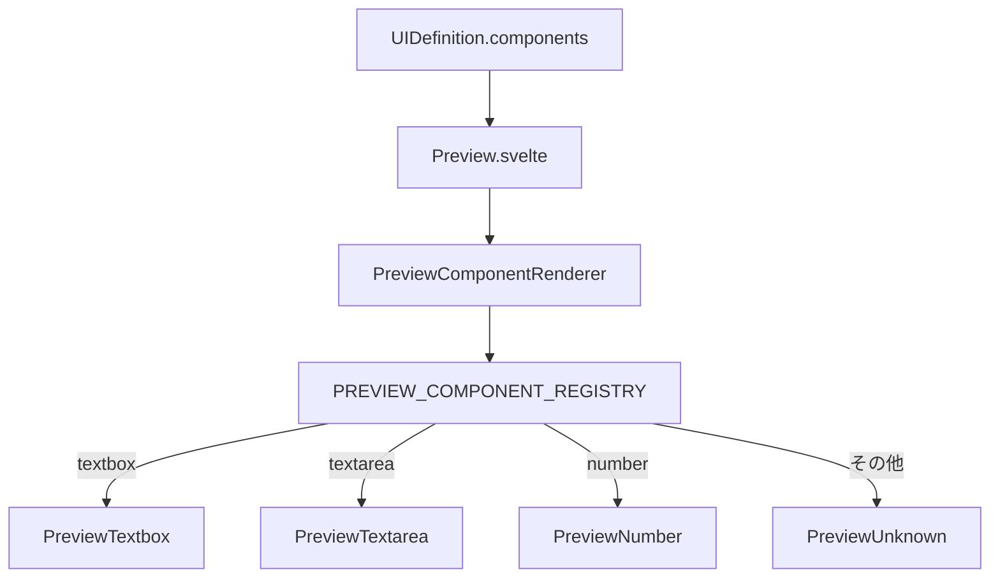

# ユースケース: レイアウトエディタ編集

最終更新: 2026-08-09 23:45

## 概要

`/layout-editor` 配下で UI 定義メタとコンポーネント一覧を編集する。  
エントリ `/layout-editor` は `/layout-editor/property` へリダイレクトする。

| 画面 | パス | 主な操作 |
|---|---|---|
| Property | `/layout-editor/property` | コンポーネント追加・属性編集・論理 ID 確定 |
| Layout | `/layout-editor/layout` | 並べ替え（DnD） |
| Preview | `/layout-editor/preview` | 見た目確認・Export / Download |

## アクターと成功条件

- **アクター**: プロトタイプ作成者（ローカル開発者）
- **成功**: メタ（`logicalId` / `name` 等）とコンポーネント列が Context 上の `UIDefinition` に反映され、他タブ・自動保存・Export から参照できる

## 画面構成データフロー

## メタ編集と既存画面の読込

`UiDefinitionMetaAccordion` で `logicalId` を blur / オートコンプリート確定したとき:

1. `GET /api/ir/snapshot?logicalId=…` を呼ぶ
2. 見つかれば store をその snapshot で置換
3. **404 は無視**（新規 logicalId として現在の components を維持＝「既存画面をコピーして別名保存」用途）

`logicalId` の妥当性は `isValidLogicalId`（`/^[a-zA-Z][a-zA-Z0-9_-]*$/`）。  
パスセグメントとしても同じ制約（`assertSafeLogicalIdPathSegment`）で traversal を防ぐ。

## プレビュー描画

- テーマは `preview-theme--{value}` クラス + `preview-theme-styles.ts`
- Export / Download ボタンは `isUiDefinitionMetaReady` かつ非 busy のときのみ有効

## Property 属性テーブル

`ComponentAttributeTable` で `UIDefinition.components` を行編集する。

- **常時表示列**: 行選択 / `logicalId` / `type` / `label`
- **列グループ切替**（presentation state。IR / snapshot には載せない）: `Basic` | `Details` | `Validation`（関心別。type 名では増やさない）

| グループ | 追加列 | 編集対象（セル内で type 分岐） |
|---|---|---|
| Basic | hint | 共通。非対応は `- not supported -` |
| Details | details | choice → `items`、date 系 → `format`、textarea → `cols` / `rows` |
| Validation | validation | `required`、textbox → `pattern` / `minlength` / `maxlength`、textarea → `maxlength`、number → `min` / `max`、date 系 → min/max 境界 |

日付系 IR の SSOT は `format` のみ（`placeholder` は持たない）。PrimeFaces export 時の HTML `placeholder` は shape が `format` の英字トークンを `_` マスク化した文字列を導出する。

`TagsInput` は IR 非依存（Enter / カンマで追加、Badge で削除）。`data-arrow-nav-focus` により外側の `arrowNavigation` が削除ボタンではなく入力へフォーカスする。

items 表記は `${value}${itemDelimiter}${label}`（同一なら区切りなし）。`itemDelimiter` は `config/application.yml` の `layoutEditor.property.itemDelimiter`（既定 `|`）。

## コンポーネント種別（現状）

Factory: `createTextbox` / `createTextarea` / `createNumber` / `createCheckbox` / `createRadio` / `createDropdown` / `createDropdownMulti` / `createDatepicker` / `createDateSpan` / `createDatetimepicker` / `createTimepicker` / `createLabel` など。  
共通フィールド例: `id`, `type`, `logicalId`, `label`, `validation` など。  
`id` は編集セッション用。snapshot 保存時は除去し、読込時に `nanoid` で再生成する。

## 関連実装

| 領域 | パス |
|---|---|
| Store | `src/lib/store/layout-editor/layout-editor.svelte.ts` |
| Layout shell | `src/routes/layout-editor/+layout.svelte` |
| 初期読込 | `src/routes/layout-editor/+layout.server.ts` |
| 属性テーブル | `src/lib/components/ComponentAttributeTable.svelte` |
| Details セル | `src/lib/components/ComponentDetailsCell.svelte` |
| Validation セル | `src/lib/components/ComponentValidationCell.svelte` |
| TagsInput | `src/lib/components/TagsInput.svelte` |
| Preview | `src/lib/components/Preview.svelte` |
