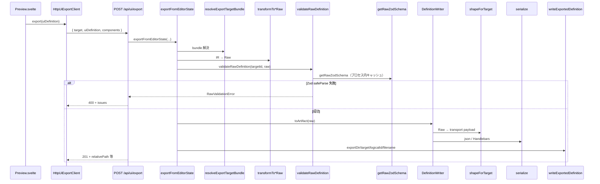
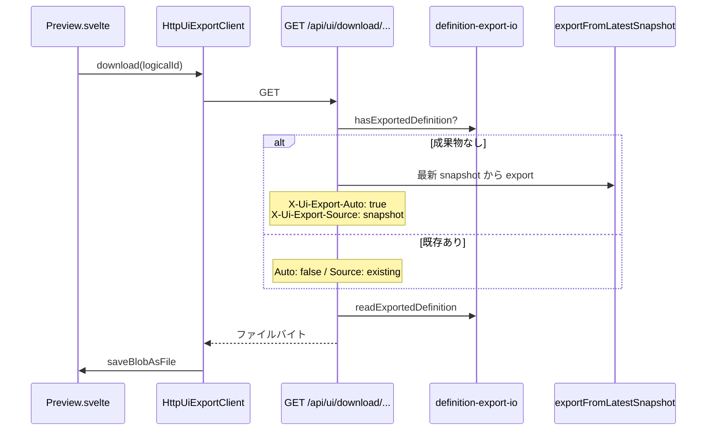
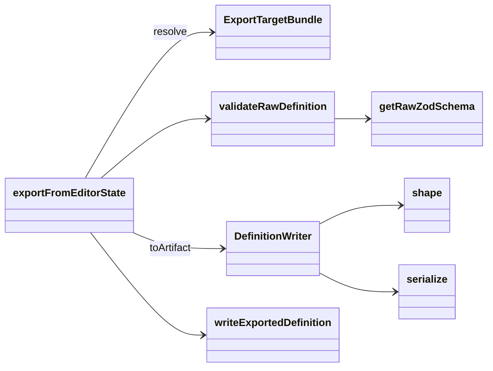

# ユースケース: 外部 UI 定義の出力（Export）

最終更新: 2026-08-12 21:38

## 概要

Preview の「出力」「ダウンロード」から、編集中 IR（store）を target 固有の外部定義ファイルへ書き出す。

対応 target（現状）:

| targetId | 詳細 |
|---|---|
| `primefaces` | [PrimeFaces Export](./primefaces-export.md) |
| `im-forma` | [im-forma Export](./im-forma-export.md) |

クライアントは `targetId` だけを選ぶ。json / yaml / Handlebars の戦略は各 `DefinitionWriter` の内部事情。  
**target 固有のコンポーネント対応・shape フィールド・テンプレート規約・serialize 方言**は各 target ドキュメントに分離する（本稿は横断パイプラインに留める）。

## API 形状（重要）

| 操作 | Method / Path | target の渡し方 |
|---|---|---|
| 明示出力 | `POST /api/ui/export` | **JSON body** の `target` |
| ダウンロード | `GET /api/ui/download/[target]/[logicalId]` | **パスパラメータ** |

※ `POST /api/ui/export/[target]/[logicalId]` というパスは **存在しない**。クライアントは `HttpUiExportClient.export` が body に `target` を載せる。

## 明示出力シーケンス



パイプライン本体: `src/lib/server/ui/export-pipeline.ts` の `exportFromEditorState`。

1. `resolveExportTargetBundle(targetId)`
2. `bundle.transform(meta, components)` → `RawDefinition`
3. `validateRawDefinition(targetId, raw)` ← **ここで Zod（JSON Schema 由来）検証**（shape 後は再検証しない）
4. `bundle.writer.toArtifact(raw)`（内部で shape → serialize）
5. `writeExportedDefinition(...)`

## ダウンロードシーケンス



注意: **既存成果物がある場合は再 export しない**（古いファイルがそのまま返る）。更新したいときは「出力」を先に実行する。

## ファイル配置

```text
<data/export>/<targetId>/<logicalId>/<filename>
```

`<filename>` の拡張子・MIME は `DefinitionWriter.describeArtifact` / `toArtifact` が決定する。  
`definition-export-io` はディレクトリ配置と書込のみを担当する。

## Writer 内部: shape / merge / serialize

| 層 | 責務 | パス例 |
|---|---|---|
| shape / merge | 検証済み Raw → ベンダー埋め込み用 payload（必要なら原文 merge） | `writers/shape/*`, `writers/merge/*` |
| serialize | payload → ファイル本文 | `serialize-*.ts` / Handlebars |
| Writer | `describeArtifact` + shape + serialize の合成 | `*-writer.ts` |

- Import 由来の残余（`external['<targetId>']`）を shape でどう扱うかは target 依存。典型例として、残余を先に spread し IR 所有キーで上書きする、または原文を merge 起点にする、などがある。詳細は各 target 文書。
- Handlebars 経路の HTML escape は **コンポーネントテンプレートの `{{ }}`**。独自 `escapeHtml` は使わない。
- テンプレート根: `app.io.export.templates.<targetId>.dir`（config で差し替え可）
- yaml serialize ヘルパは、yaml を吐く target が追加されたときに同時実装（現状 target なし）

## Raw 検証と JSON Schema

- Schema ファイル: `schemas/raw/<filename>`（レジストリでファイル名を明示）
- 対応拡張子: `.json` / `.yaml` / `.yml`（拡張子に応じて `JSON.parse` または `js-yaml`）
- 読込: `json-schema-loader.ts` → オブジェクト → `z.fromJSONSchema` → プロセス内 `Map` キャッシュ
- 検証: `validateRawDefinition`（失敗時 `RawValidationError`、メッセージは Zod 日本語ロケール）
- WARN: YAML を採用する場合はレジストリに `.yaml` / `.yml` を**明示**する。暗黙の自動探索（同 stem の json/yaml 切り替え）はしない
- YAML をレジストリに登録した target では、同内容の `.json` 物理ファイルは不要（必要なら `schema:convert` で生成）

### 草案・変換 CLI

| コマンド | 役割 |
|---|---|
| `npm run schema:infer -- …` | サンプルから JSON Schema 草案。`--format json\|yaml\|both` |
| `npm run schema:convert -- <input>` | JSON Schema の JSON ↔ YAML 相互変換（`--check` で往復検証） |

### 運用上の注意

1. **required はオブジェクトの `required` 配列で指定する**（draft 2020-12）。プロパティ内の `"required": true`（draft-3 名残）だけでは不十分な場合がある。コンポーネント（field/item）側も `logicalId` / `type` / `label` 等を `required` に含めること。
2. **Schema は target 初回検証時にキャッシュされる**。サーバ起動後に Schema ファイルを直しても、現状はプロセス再起動（または将来の `invalidateRawZodSchema` 呼び出し）まで反映されない。
3. エディタは空の `logicalId` / `label` を許容し得るが、Schema が `minLength: 1` 等を要求していれば **Export 時に 400** になる（境界検証）。

## モジュール関係（Export 周辺）



## 関連実装

| 領域 | パス |
|---|---|
| Pipeline | `src/lib/server/ui/export-pipeline.ts` |
| Registry | `src/lib/server/ui/export-target-registry.ts` |
| Validate | `src/lib/schema/validate-raw.ts` |
| Schema loader | `src/lib/schema/json-schema-loader.ts` |
| shape | `src/lib/server/io/writers/shape/` |
| merge | `src/lib/server/io/writers/merge/` |
| serialize | `src/lib/server/io/writers/serialize/` |
| Templates | `templates/export/<targetId>/`（config で差し替え可） |
| Client | `src/lib/store/layout-editor/ui-export-client.ts` |
| API | `src/routes/api/ui/export/+server.ts` |
| Download API | `src/routes/api/ui/download/[target]/[logicalId]/+server.ts` |

## 関連ドキュメント

- [im-forma Export](./im-forma-export.md)
- [PrimeFaces Export](./primefaces-export.md)
- [UI Import](./ui-import.md)
- [HTTP API](../api/http-endpoints.md)
