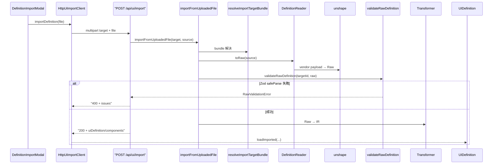

# 外部 UI 定義の取り込み（Import）

最終更新: 2026-08-28 07:36

外部 UI 定義ファイルをアップロードし、IR へ変換してエディタの編集状態を丸ごと置き換える。
出力側は [UI Export](./ui-export.md) を参照。

## 対応 target

| targetId | 詳細 |
|---|---|
| `im-forma` | [im-forma Import](./im-forma-import.md) |
| `primefaces` | [PrimeFaces Import](./primefaces-import.md) |

受付拡張子・parse / unshape / transform の具象は各 target ドキュメントを参照。  
UI の選択肢は `UI_IMPORT_CLIENT_REGISTRY` で絞り込むため、Reader 未実装の target は表示されない。

## パイプライン

Export の各段の鏡像として構成する。

```text
アップロードファイル
  → DefinitionReader（parse → unshape）→ RawDefinition
  → SchemaValidator（JSON Schema → Zod）
  → Transformer → IR（uiDefinition + components）
  → UIDefinition.loadImported()
```



## 層の責務

| 層 | ファイル | 責務 |
|---|---|---|
| parse | `server/io/readers/parse/parse-json.ts` / `parse-xml.ts` | ファイル本文 → 値（`serialize` の対） |
| unshape | `server/io/readers/unshape/*-unshape.ts` | ベンダー語彙 → Raw 語彙（`shape` / merge の対） |
| Reader | `server/io/readers/*-reader.ts` | parse + unshape の合成、受付拡張子の宣言 |
| registry | `server/ui/import-target-registry.ts` | targetId → Reader / Transformer |
| pipeline | `server/ui/import-pipeline.ts` | 拡張子検査 → Reader → validate → Transformer |

## external 残余と Export merge

形式固有の未モデル化データは `external['<targetId>']` に退避する。  
一部 target は Import 時の原文（またはその一部）を同バッグに保持し、Export の merge 起点にする。キー名・文書判定・type マップは target ドキュメント側。

## エディタへの反映

`UIDefinition.loadImported(imported)` が

1. `createComponentByType` で type 別ファクトリを適用（デフォルト値の補完 + エディタ用 `id` 採番）
2. `loadSnapshot` に委譲して components とメタを全置換

を行う。未登録 type は `id` だけ付けて素通しする。

取り込み後は `logicalId` が変わるため、debounce 後に **新しい logicalId のディレクトリへ
snapshot が自動保存される**（既存世代は削除されない）。UI 側でその旨を警告する。  
反映に成功するとモーダルを閉じ、Global Toast（`info`）を出す。失敗はモーダル内の `Alert` に留め、Toast には出さない。

## 失敗時の扱い

| 状況 | 応答 |
|---|---|
| 未対応 / 未指定 target | 400 |
| 拡張子不一致 | 400（`DefinitionReadError`） |
| パース失敗 / target 固有の読取拒否 | 400（`DefinitionReadError`） |
| Raw 検証失敗（`logicalId` が識別子として不正 等） | 400（`issues[]` 付き） |
| 2MB 超のアップロード | 400 |

`logicalId` は `^[a-zA-Z][a-zA-Z0-9_-]*$` を満たす必要がある。target によってはファイル名 stem から導出・補正することがある（詳細は各 target 文書）。それ以外の不正値は自動サニタイズせず 400 とする。

## 関連ドキュメント

- [UI Export](./ui-export.md)
- [Global Toast](./global-toast.md)
- [im-forma Import](./im-forma-import.md)
- [PrimeFaces Import](./primefaces-import.md)
- [HTTP API](../api/http-endpoints.md)
- [アーキテクチャ概要](../architecture/overview.md)
