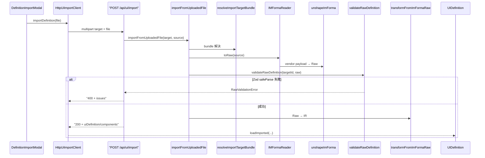

# 外部 UI 定義の取り込み（Import）

最終更新: 2026-08-10 06:20

外部 UI 定義ファイルをアップロードし、IR へ変換してエディタの編集状態を丸ごと置き換える。
出力側は [UI Export](./ui-export.md) を参照。

## 対応 target

| targetId | 拡張子 | parse | unshape | transform | 詳細 |
|---|---|---|---|---|---|
| `im-forma` | `.json` | `JSON.parse` | `unshapeImForma` | `transformFromImFormaRaw` | （本稿の共通境界） |
| `primefaces` | `.xhtml` | `fast-xml-parser` | `unshapePrimeFaces` | `transformFromPrimeFacesRaw` | [PrimeFaces Import](./primefaces-import.md) |

UI の選択肢は `UI_IMPORT_CLIENT_REGISTRY` で絞り込むため、Reader 未実装の target は表示されない。

## パイプライン

Export の各段の鏡像として構成する。

```text
アップロードファイル
  → DefinitionReader（parse → unshape）→ RawDefinition
  → SchemaValidator（JSON Schema → Zod）
  → Transformer → IR（uiDefinition + components）
  → UIDefinition.loadImported()
```



## 層の責務

| 層 | ファイル | 責務 |
|---|---|---|
| parse | `server/io/readers/parse/parse-json.ts` / `parse-xml.ts` | ファイル本文 → 値（`serialize` の対） |
| unshape | `server/io/readers/unshape/*-unshape.ts` | ベンダー語彙 → Raw 語彙（`shape` の対） |
| Reader | `server/io/readers/*-reader.ts` | parse + unshape の合成、受付拡張子の宣言 |
| registry | `server/ui/import-target-registry.ts` | targetId → Reader / Transformer |
| pipeline | `server/ui/import-pipeline.ts` | 拡張子検査 → Reader → validate → Transformer |

## external 残余によるベンダー ID の保持

IR がモデル化しないキー（外部システム ID など）は、Reader が **target 名前空間付きの残余バッグ**へ退避する。

```json
{
  "logicalId": "applicantName",
  "type": "textbox",
  "label": "申請者名",
  "external": { "im-forma": { "itemSystemId": "IMF-ITEM-0001" } }
}
```

| 位置 | 退避先 | 既知キー（残余に入らないもの） |
|---|---|---|
| 定義レベル | `uiDefinition.external['im-forma']` | `formId` / `formName` / `description` / `version` / `items` |
| 要素レベル | `component.external['im-forma']` | `logicalId` / `type` / `label` / `hint` / `disabled` / `readonly` / `hidden` / `required` / `validation` / `items` / `format` / `clearable` / `rows` / `cols` / `multiple` |

export 時は `shapeImForma` が残余を **先に** spread し、IR 所有キーで上書きする。
残余は component に同居するため、並べ替え・削除・`logicalId` 変更に自動追随する。

永続化と送信の経路:

- snapshot: `UiDefinitionEditorMeta.external` として YAML に保存（component 側は素通し）
- export API: `HttpUiExportClient.export` が body の `uiDefinition.external` に載せる

WARN: component 複製機能を追加する場合、`external` を引き継ぐと外部システム ID が重複する。

## エディタへの反映

`UIDefinition.loadImported(imported)` が

1. `createComponentByType` で type 別ファクトリを適用（デフォルト値の補完 + エディタ用 `id` 採番）
2. `loadSnapshot` に委譲して components とメタを全置換

を行う。未登録 type は `id` だけ付けて素通しする。

取り込み後は `logicalId` が変わるため、debounce 後に **新しい logicalId のディレクトリへ
snapshot が自動保存される**（既存世代は削除されない）。UI 側でその旨を警告する。

## 失敗時の扱い

| 状況 | 応答 |
|---|---|
| 未対応 / 未指定 target | 400 |
| 拡張子不一致 | 400（`DefinitionReadError`） |
| パース失敗 / 必須構造欠落（例: `h:form` 無し） | 400（`DefinitionReadError`） |
| Raw 検証失敗（`logicalId` / `formId` が識別子として不正、`label` 空 等） | 400（`issues[]` 付き） |
| 2MB 超のアップロード | 400 |

`logicalId`（IM-Forma では `formId`、PrimeFaces では `h:form id`）は `^[a-zA-Z][a-zA-Z0-9_-]*$` を満たす必要がある。
満たさない場合は自動サニタイズせず 400 とする。

## 関連ドキュメント

- [UI Export](./ui-export.md)
- [PrimeFaces Import](./primefaces-import.md)
- [HTTP API](../api/http-endpoints.md)
- [アーキテクチャ概要](../architecture/overview.md)
